# Audyt UI/UX — Developer Command Center

Data audytu: 4 sierpnia 2026  
Zakres: `Dzisiaj → Cele → szczegóły Celu → Inbox → Wiedza → globalne wyszukiwanie`, desktop 1440×1000 i mobile 390×844.  
Tryb: lokalny tryb demonstracyjny, bieżący zapis użytkownika.  

## Werdykt

Fundament wizualny jest spójny i aplikacja technicznie jest w dobrej kondycji, ale kilka kontrolek obiecuje funkcje, których nie realizuje. Najpoważniejsze luki dotyczą Wiedzy, odkładania elementów Inboxu, typów przechwycenia „Głos/Plik”, dokładnych wyników wyszukiwania oraz zarządzania Działaniami na telefonie.

Przed dalszym polerowaniem wyglądu warto zamknąć P0 i P1. To one odpowiadają za odczucie, że „nie wszystko działa”.

## Co działa dobrze

- Główna nawigacja i podział na Dzisiaj, Cele, Wiedzę i Inbox są łatwe do zrozumienia.
- Ciemny motyw, tokeny, typografia i ikony są spójne między ekranami.
- Najważniejsze formularze mają etykiety, stany `disabled`, komunikaty błędów i sensowny fokus początkowy.
- Modal współdzielony przez większość ekranów ma pułapkę fokusu, Escape i przywracanie fokusu.
- Archiwizacja i część operacji mają możliwość cofnięcia.
- Układ przechodzi na dolną nawigację i jednokolumnowe karty na mobile.
- Kontrole jakości są zielone: 105/105 testów, lint, typecheck i build.

## Stan przebiegu

| Krok | Widok / zadanie | Stan |
|---|---|---|
| 1 | Dzisiaj — orientacja i wybór kolejnego kroku | Wymaga poprawy |
| 2 | Cele — filtrowanie i otwarcie Celu | Dobry, z drobnymi tarciami |
| 3 | Utworzenie Celu | Wymaga poprawy |
| 4 | Szczegóły Celu i obsługa Działań | Słaby na mobile, niepełny funkcjonalnie |
| 5 | Inbox — przechwycenie i triage | Częściowo działa; ważne obietnice są niespełnione |
| 6 | Wiedza — znalezienie, otwarcie i edycja | Krytycznie niepełny |
| 7 | Działanie cykliczne | Działa, ale formularz jest za ciężki na mobile |
| 8 | Globalne szybkie przechwycenie | Działa; copy i akcje wymagają uproszczenia |
| 9 | Globalne wyszukiwanie | Wyszukuje, ale nie prowadzi do dokładnego obiektu |
| 10 | Nawigacja i stan aplikacji na mobile | Brakuje wyszukiwania, licznika Inboxu i menu konta/synchronizacji |

## P0 — naprawić przed kolejnym wydaniem

### P0.1 Odłożony Inbox nie wraca

UI obiecuje „Odłóż do jutra” i „Element wróci do Inboxu później”, ale lista pokazuje wyłącznie rekordy ze stanem `unprocessed`. Nie ma mechanizmu, który po `snoozedUntil` przywraca stan, ani widoku odłożonych elementów.

**Sugestia:** przy ładowaniu i okresowo materializować należne elementy jako `unprocessed` albo włączać do listy elementy `snoozed` z datą w przeszłości. Dodać sekcję/filtr „Odłożone” z dokładnym terminem i akcją „Przywróć teraz”. „Jutro” powinno oznaczać jawnie np. następny dzień o 09:00 w strefie Workspace, nie `Date.now() + 24 h`.

**Kryterium akceptacji:** odłożony element znika z bieżącej listy, jest widoczny w „Odłożone”, a po terminie automatycznie wraca do „Do przetworzenia”.

### P0.2 Wiedzy nie można otworzyć ani edytować

Wiersze Wiedzy nie są linkami i oferują tylko Archiwizuj/Trash. Parametr `?item=...`, używany przez globalne wyszukiwanie i linki z Celu, jest ignorowany. Użytkownik nie może przeczytać pełnej treści, poprawić jej, zmienić typu, źródła ani powiązań.

**Sugestia:** dodać szczegóły Wiedzy jako route `/knowledge/:id` albo panel boczny sterowany `?item=id`. W widoku szczegółów: edycja tytułu i treści, URL źródła, typ, powiązania, backlinks do Celów/Działań/serii, data modyfikacji, Archive/Trash z cofnięciem.

**Kryterium akceptacji:** kliknięcie wiersza i wyniku wyszukiwania otwiera dokładny element; link `?item=id` odtwarza ten sam stan po odświeżeniu.

### P0.3 „Głos” i „Plik” są fałszywymi affordance

Kliknięcie „Głos” lub „Plik” tylko zmienia typ zwykłego tekstowego wpisu. Nie uruchamia nagrywania ani wyboru pliku. Dla Linku nie ma walidacji ani podglądu URL.

**Sugestia:** albo wdrożyć prawdziwe nagrywanie/załączanie pliku i walidację linku, albo do czasu implementacji usunąć te opcje z produkcyjnego UI i zostawić „Tekst” + automatyczne rozpoznawanie URL. Nie należy zapisywać wpisu jako `file`, jeśli nie istnieje plik lub trwały identyfikator załącznika.

**Kryterium akceptacji:** każda widoczna opcja przechwycenia wykonuje inną, zgodną z nazwą operację i pokazuje stan powodzenia/błędu.

## P1 — wysoki wpływ na główny przepływ

### Dzisiaj i Działania

1. **Dodać zwykłe Działanie bezpośrednio z Dzisiaj.** Pusty ekran mówi o przypięciu Działania, ale jedyne CTA tworzy serię cykliczną. Potrzebne są dwa CTA: „Dodaj Działanie” oraz drugorzędne „Nowe cykliczne”.
2. **Dodać jawne Przypnij/Odepnij od Dzisiaj** w szczegółach Działania i na liście. Obecnie `pinnedToToday` można ustawić tylko podczas triage Inboxu.
3. **Przebudować mobilny pasek akcji Działania.** Ikony i etykiety zawijają się na 2–3 rzędy. Na mobile pokazać tylko Ukończ, Następne i menu `…`; resztę przenieść do bottom sheetu.
4. **Zmienić „Anuluj” na „Anuluj Działanie”.** Obok ikon edycji „Anuluj” wygląda jak anulowanie bieżącej operacji. Akcja zmiany stanu powinna mieć potwierdzenie lub Undo.
5. **Pokazać i obsługiwać checklistę.** Checklistę można zapisać podczas edycji, ale nie jest nigdzie widoczna ani klikalna. Edycja odtwarza wszystkie punkty z `completed: false`, więc może kasować postęp.
6. **Nie pozwalać ustawić Celu jako osiągnięty jednym selectem bez decyzji.** Przed `Osiągnięty` pokazać kryteria i otwarte Działania; przy `Porzucony` poprosić o krótki powód. Zapisać to jako aktualizację postępu.
7. **Dodać edycję samego Celu i kryteriów sukcesu.** Obecnie można zmienić stan i Działania, ale nie tytuł, rezultat, Obszar, priorytet ani kryteria. Kryteriów nie można też oznaczać jako spełnione.

### Inbox

8. **Dodać zakładki „Do przetworzenia / Odłożone / Zakończone / Odrzucone”.** Copy mówi, że oryginał pozostanie w historii i odzyskiwaniu, ale nie ma UI tej historii ani przywracania.
9. **Ujednolicić dwa miejsca przechwycenia.** Globalny modal zachowuje draft, natomiast karta w Inboxie nie. Oba powinny używać tego samego komponentu, tych samych typów, walidacji, skrótu i komunikatów.
10. **Pokazywać postęp i blokować wieloklik.** Triage, Odłóż i Odrzuć powinny mieć lokalny stan ładowania. Błąd synchronizacji nie może być jedyną informacją, szczególnie że znika wraz z topbarem na mobile.

### Wiedza i wyszukiwanie

11. **Globalne wyszukiwanie ma prowadzić do dokładnego wyniku.** Wynik Wiedzy kończy na ogólnej liście; wynik Inboxu nie otwiera elementu; wynik Działania otwiera Cel bez zaznaczenia Działania. Dodać stabilne deep linki i podświetlenie/scroll do obiektu.
12. **Uczynić cały wiersz/kartę Wiedzy klikalnym.** Archiwizacja i Trash zostają jako menu kontekstowe, aby nie konkurowały z podstawową akcją „Otwórz”.
13. **Naprawić sprzeczne metadane.** Przykład „FinTrack API • zaktualizowano wczoraj” i zaraz pod nim „Bez powiązań” wygląda jak błąd. Opis treści, źródło i rzeczywiste relacje muszą być osobnymi, nazwanymi polami.
14. **Zastąpić natywny multi-select wyboru Celów.** Jest mało czytelny i niewygodny na dotyku. Lepszy będzie combobox z wyszukiwaniem i chipami wybranych Celów.

### Mobile i dostęp do stanu konta

15. **Dodać mobilne menu konta/Workspace.** Po ukryciu sidebara i topbara nie ma eksportu, wylogowania, resetu demo ani informacji o synchronizacji/błędzie.
16. **Dodać mobilne wyszukiwanie.** Globalne wyszukiwanie znika całkowicie poniżej 768 px. Dobrym miejscem jest ikona w nagłówku albo akcja w menu `…`.
17. **Pokazać licznik Inboxu w dolnej nawigacji.** Desktop ma badge `3`, mobile nie pokazuje pilności.

### Dostępność i niezawodność interakcji

18. **Przenieść trzy ręcznie zbudowane modale Działania na współdzielony `Modal`.** Blokowanie, edycja i wiązanie Wiedzy nie mają pułapki fokusu, Escape, zamknięcia tła ani przywrócenia fokusu.
19. **Dodać programowy stan wyboru.** Filtry Celów/Wiedzy oraz typy przechwycenia używają głównie koloru. Dodać `aria-pressed` albo prawdziwe tablisty/radia.
20. **Powiększyć mobilne cele dotykowe przy akcjach.** Kontrole Działań mają około 34 px; dla kluczowych akcji celować w co najmniej 44×44 px i zachować odstęp.
21. **Nadać jednoznaczne etykiety wszystkim inputom daty i ikonom.** Szczególnie ukryty input przełożenia Działania powinien mieć własne `aria-label`/`id` + `label`, nie polegać na ikonie.

## P2 — spójność, czytelność i redukcja tarcia

1. W formularzu nowego Celu pusty szablon nadaje obu polom etykietę „Co chcesz osiągnąć?”. Drugie pole powinno brzmieć np. „Po czym poznasz, że Cel jest osiągnięty?”.
2. Na mobile nie ukrywać etykiet „Tekst / Głos / Link / Plik” bez zastąpienia ich tooltipem i nazwą widoczną przy wyborze. Same podobne ikony są zbyt niejednoznaczne.
3. Ujednolicić język: `Archive/Trash` → `Archiwum/Kosz`, `Nowy cel` vs `Wszystkie Cele`, `Cel/Działanie` pisane konsekwentnie zgodnie z przyjętym słownikiem.
4. Rozdzielić status domenowy i widoczność. „Osiągnięty/Porzucony” nie powinny być w jednej grupie z „Archiwum/Kosz” bez wizualnego podziału.
5. Na mobile schować rzadkie filtry Celów za przyciskiem „Filtry (n)”. Obecne siedem statusów zajmuje prawie cały pierwszy ekran.
6. W kartach Celów uczynić całą kartę klikalną i dodać wskaźnik ważności: brak następnego Działania, zaległość lub blokada. Sama informacja „Aktywny” ma małą wartość.
7. W widoku Wiedzy zachować widoczną etykietę typu na mobile; obecnie badge znika, a subtelna ikona nie wystarcza.
8. Formularz serii cyklicznej podzielić na „Podstawy” i rozwijane „Więcej opcji”. Przycisk zapisu powinien być sticky w bottom sheecie.
9. Daty w podglądzie serii i listach sformatować po polsku (`wt., 4 sie`) zamiast `2026-08-04`; pełny ISO zostawić w tooltipie/technicznych miejscach.
10. Globalne szybkie przechwycenie: „Zachowaj draft” jest mylone z zapisem do Inboxu. Lepsze: `Zamknij` + status „Draft zapisany na tym urządzeniu”, a `Odrzuć draft` jako akcja drugorzędna w menu.
11. Dodać sensowniejsze puste stany zależne od kontekstu: Dzisiaj powinno podpowiadać zwykłe Działanie, Wiedza — notatkę lub materiał, a filtrowana lista — wyczyszczenie filtrów.
12. Pokazywać liczbę wyników i aktywne filtry w Celach/Wiedzy oraz przycisk „Wyczyść filtry”.
13. Dodać skeletony lub stan ładowania przy zmianach list w Supabase, żeby layout nie wyglądał na zawieszony.
14. Dla Archive/Trash i zmian stanu stosować jeden wzorzec: natychmiastowa zmiana + toast Undo albo dialog potwierdzający dla ryzykownej operacji.

## P3 — polerowanie wizualne

1. Zmniejszyć pustą przestrzeń w desktopowym stanie „Dzisiaj”, np. przez mały panel „Następne sugestie” i szybkie dodanie Działania.
2. Wyrównać wysokości i rytm kart Celów; długie tytuły powinny mieć kontrolowane zawijanie, a CTA stałą pozycję.
3. Zwiększyć oddech między nagłówkiem strony a gęstymi filtrami, ale zmniejszyć odstępy wewnątrz samych grup filtrów.
4. Ujednolicić wizualną wagę działań destrukcyjnych. „Do kosza” i „Anuluj Działanie” nie powinny wyglądać tak samo jak bezpieczne akcje tekstowe.
5. Utrzymać mocny focus ring, ale nie pozwalać, by overlay wyników wyszukiwania zlewał wszystkie nieaktywne wiersze w jeden szary blok.
6. Na listach pokazywać akcje drugorzędne po hover/focus na desktopie, a na mobile pod `…`; ograniczy to wizualny hałas.

## Proponowana kolejność realizacji

### Sprint A — naprawa obietnic

1. Powrót odłożonego Inboxu + widoki historii.
2. Szczegóły/edycja Wiedzy + poprawne deep linki z wyszukiwania.
3. Usunięcie lub realna implementacja Głos/Plik/Link.
4. Ujednolicenie obsługi błędów i loadingu na mobile.

### Sprint B — główny loop

1. Szybkie dodanie i przypinanie Działania w Dzisiaj.
2. Mobilne menu akcji Działania.
3. Widoczna i klikalna checklista bez resetowania postępu.
4. Edycja Celu i kryteriów sukcesu.

### Sprint C — spójność i dostępność

1. Mobilne menu Workspace, wyszukiwanie i badge Inboxu.
2. Wszystkie modale na wspólnym komponencie.
3. `aria-pressed`, etykiety dat, cele 44×44 px i test klawiaturą/czytnikiem.
4. Ujednolicenie języka i uproszczenie filtrów/formularza cyklicznego.

## Dowody — zrzuty bieżącego audytu

### 1. Dzisiaj — desktop i mobile

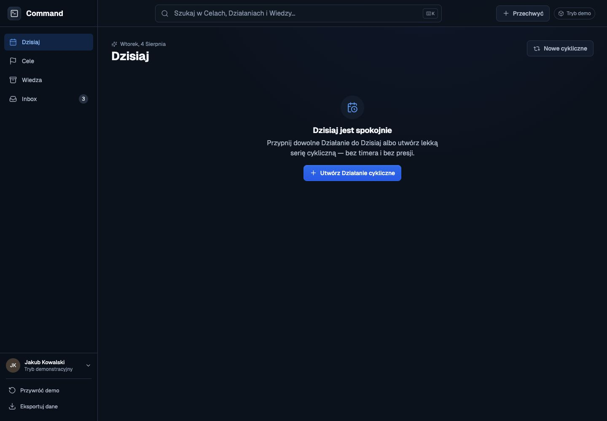

### 2. Cele — lista i tworzenie

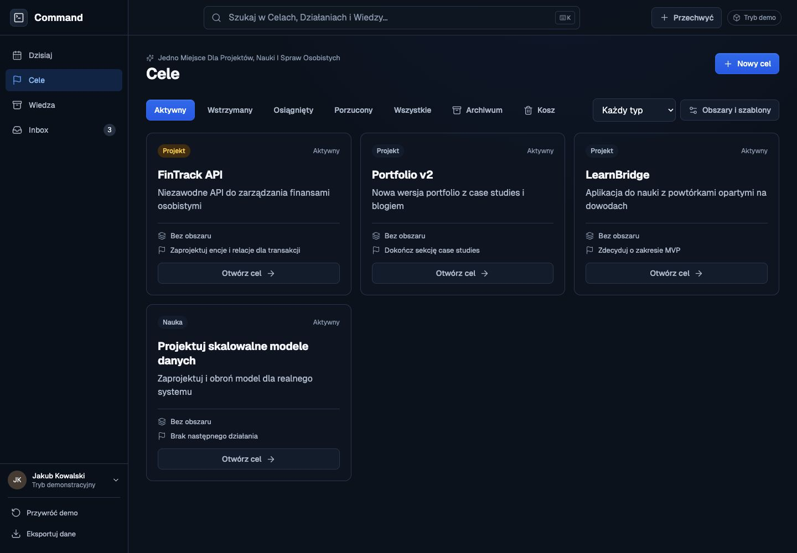

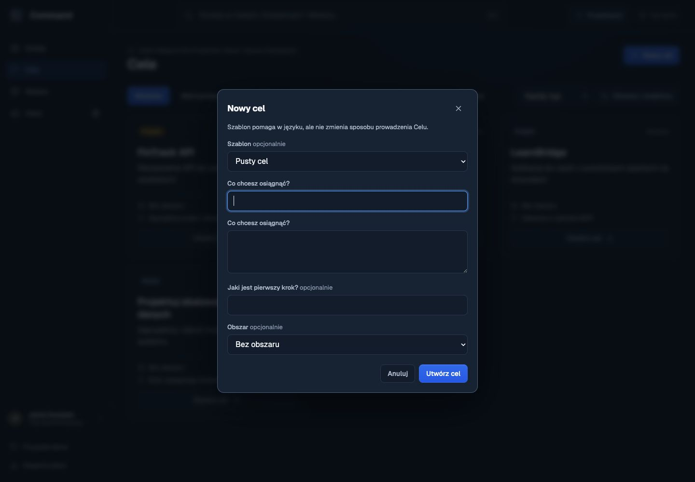

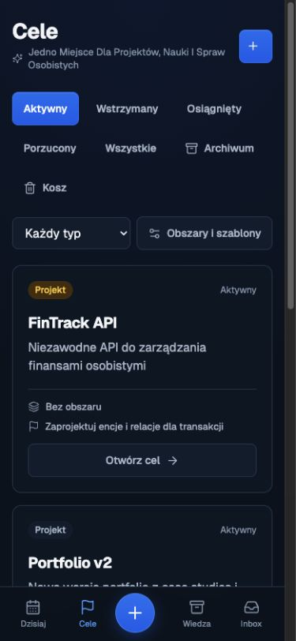

### 3. Szczegóły Celu i Działania

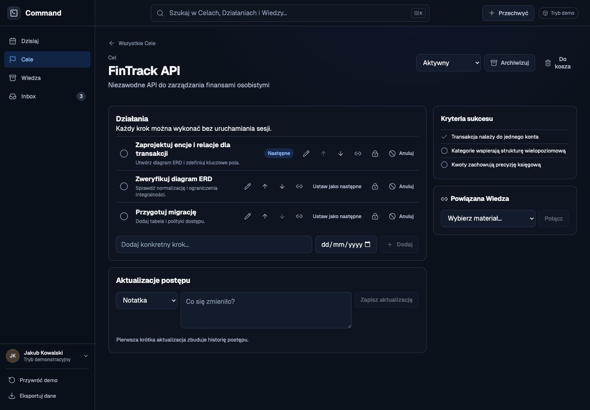

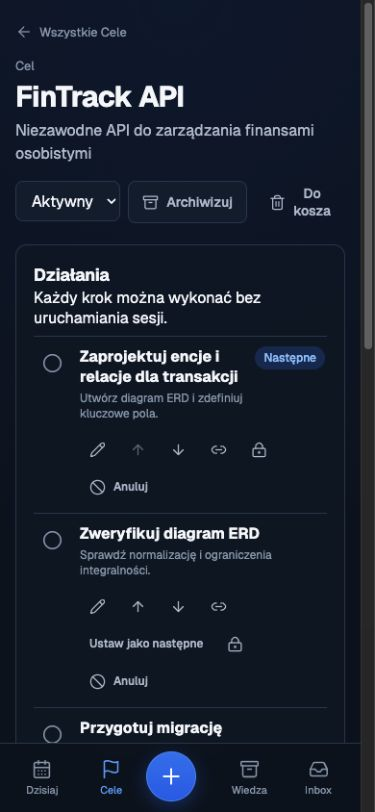

### 4. Inbox

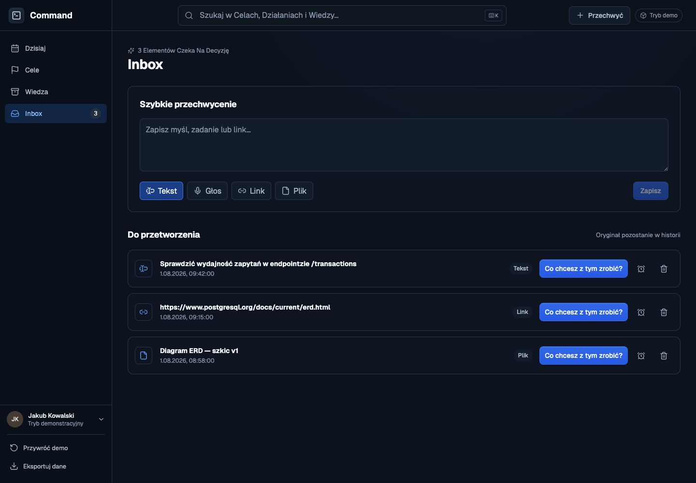

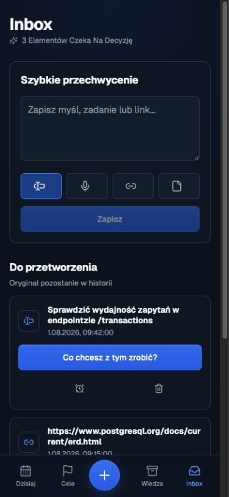

### 5. Wiedza

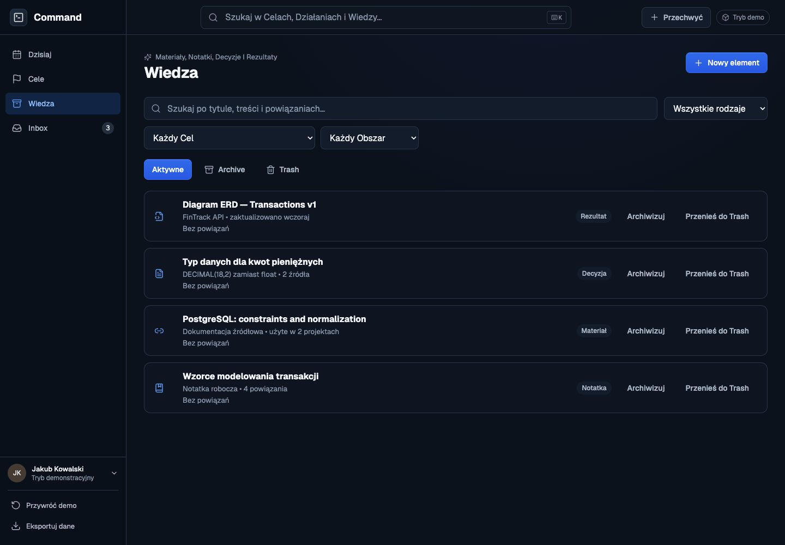

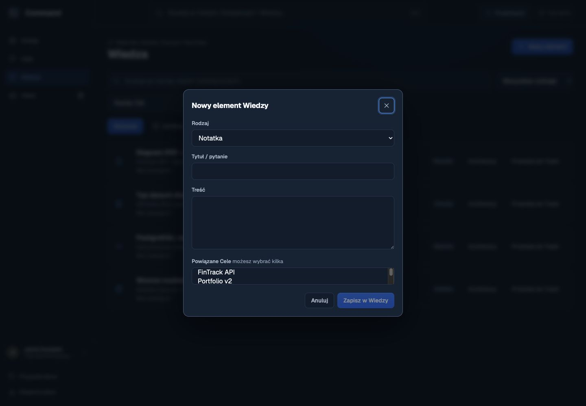

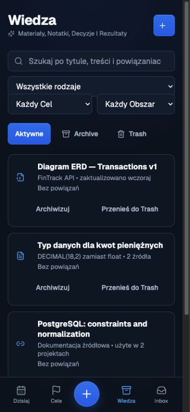

### 6. Działanie cykliczne i szybkie przechwycenie

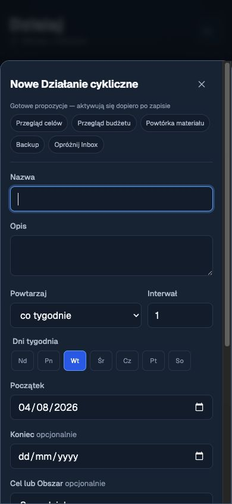

### 7. Globalne wyszukiwanie

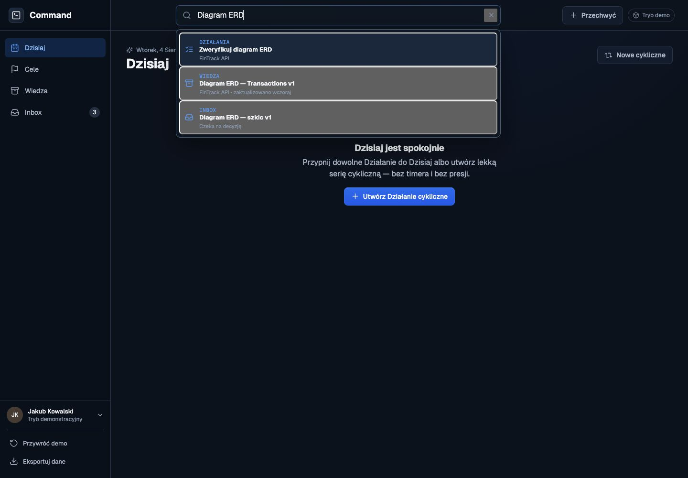

## Ograniczenia audytu

- Nie testowano prawdziwego konta Supabase, logowania, wielu Workspace'ów ani uprawnień RLS w przeglądarce.
- Nie testowano rzeczywistego offline/PWA, słabego łącza, konfliktów synchronizacji ani powiadomień systemowych.
- Ryzyka dostępności wynikają z obserwacji UI i kodu. Pełna ocena wymaga testu klawiaturą, VoiceOver/NVDA, zoomu 200–400% i automatycznego skanera kontrastu/semantyki.
- Audyt nie oznacza zgodności z WCAG. Potwierdza jedynie widoczne mocne strony i ryzyka w sprawdzonym przebiegu.

