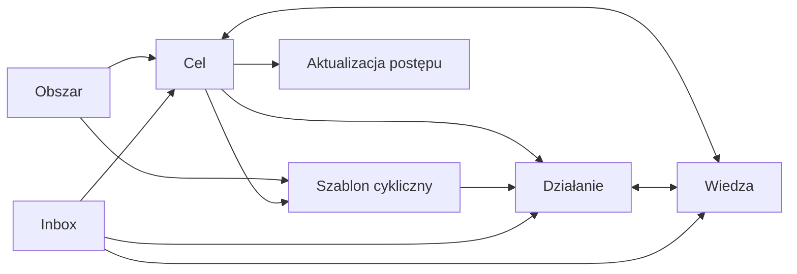

# Kierunek produktu — cele, działania cykliczne i wiedza

**Status:** zaakceptowany kierunek produktu, przed implementacją  
**Data:** 2026-08-04  
**Zastępuje:** niewykonane plany Sprintów 2–4 oparte na Focus Session

## Decyzja

Command przestaje być systemem prowadzenia sesji skupienia. Staje się prostym
systemem do:

1. definiowania dowolnych celów;
2. wybierania pojedynczych i cyklicznych działań;
3. zapisywania postępu bez uruchamiania timera;
4. budowania wiedzy powiązanej z celami i działaniami;
5. szybkiego przechwytywania materiału do późniejszego uporządkowania.

Typ celu wpływa na podpowiedzi i szablon formularza, ale nie tworzy osobnego
modułu ani osobnego cyklu pracy. Cel projektowy, edukacyjny, osobisty i własny
użytkownika korzystają z tego samego modelu.

Przez „własne komponenty” rozumiemy w pierwszej wersji trzy rozszerzalne
elementy:

- własne **Obszary**, np. Zdrowie, Dom, Firma lub Finanse;
- własne **szablony celów**, np. Nauka języka, Premiera produktu lub Remont;
- własne **szablony działań cyklicznych**, np. Przegląd budżetu lub Backup.

Nie budujemy w MVP generatora dowolnych pól ani wizualnego konstruktora bazy.
Szablony pozostają proste i przewidywalne.

## Zasady upraszczające

- Użytkownik nie musi rozumieć pojęć Commitment, Work Item, Focus Session,
  Checkpoint ani Learning Evidence.
- Czas nie jest wymagany do rozpoczęcia ani zakończenia działania.
- Każde działanie można wykonać bez powiązania z celem; powiązanie pozostaje
  zalecane, ale opcjonalne.
- Wiedza może istnieć samodzielnie albo być powiązana z wieloma celami i
  działaniami.
- Zadanie cykliczne jest szablonem tworzącym zwykłe wystąpienia działań, a nie
  osobnym rodzajem listy z innymi zasadami.
- Funkcje zaawansowane są ukrywane do momentu, kiedy użytkownik ich potrzebuje.

## Nowa architektura informacji

Główna nawigacja ma cztery pozycje:

1. **Dzisiaj** — zaplanowane, zaległe i ręcznie wybrane następne działania.
2. **Cele** — wszystkie cele, filtrowane po stanie, Obszarze i szablonie.
3. **Wiedza** — notatki, materiały, decyzje, rezultaty i wyszukiwanie.
4. **Inbox** — szybkie przechwycenie i późniejsza zamiana na cel, działanie lub
   element wiedzy.

Zarządzanie działaniami cyklicznymi jest zakładką w widoku Dzisiaj, a nie piątą
główną sekcją. Obszary i szablony są dostępne w Ustawieniach oraz w kontekście
tworzenia obiektu.

### Widok Dzisiaj

- „Na dziś” — działania zaplanowane na dzisiaj i ręcznie przypięte;
- „Zaległe” — tylko elementy wymagające decyzji;
- „Nadchodzące” — krótki podgląd, bez pełnego kalendarza;
- szybkie operacje: ukończ, przełóż, pomiń wystąpienie, otwórz cel;
- brak timera i obowiązkowego przycisku rozpoczęcia pracy.

### Widok celu

- nazwa i oczekiwany rezultat;
- kryteria ukończenia;
- następne działania;
- działania cykliczne;
- powiązana wiedza;
- prosta historia postępu i decyzji.

### Widok wiedzy

- wspólna biblioteka wszystkich typów wiedzy;
- filtrowanie po typie, Obszarze i powiązanym celu;
- możliwość podpięcia jednego elementu do wielu celów i działań;
- zapis źródła oraz relacji pochodzenia z Inboxu.

## Model pojęciowy

### Obszar

Trwały kontekst bez warunku ukończenia. Obszary są tworzone przez użytkownika.
Przykłady: Zdrowie, Dom, Firma, Nauka, Finanse.

Minimalne pola:

- `id`, `workspace_id`, `name`, `color`, `icon_key`;
- `archived_at`, `created_at`, `updated_at`.

### Szablon celu

Nadaje formularzowi język i sensowne wartości początkowe, ale nie zmienia
zachowania celu. Dostarczone szablony startowe:

- Projekt;
- Nauka;
- Cel osobisty;
- Utrzymanie;
- Pusty cel.

Użytkownik może sklonować szablon startowy lub utworzyć własny. Szablon
przechowuje nazwę, opis, etykietę rezultatu, etykietę kryteriów i opcjonalne
domyślne działania. Nie przechowuje wykonywalnego kodu ani dowolnego schematu
formularza.

### Cel

Wspólny następca Project i Learning Goal.

Minimalne pola:

- `entity_id`, `workspace_id`, `area_id`, `goal_template_id`;
- `outcome`, `success_criteria`;
- `status`: `draft`, `active`, `paused`, `achieved`, `abandoned`;
- `priority`: `now`, `next`, `later`;
- opcjonalne `target_date`, `achieved_at`, `abandoned_at`.

### Działanie

Jedna konkretna rzecz do wykonania. Zastępuje Work Item w interfejsie i nowym
kontrakcie domenowym.

Minimalne pola:

- `entity_id`, `workspace_id`, opcjonalne `goal_id` i `area_id`;
- `description`, `status`: `open`, `in_progress`, `blocked`, `completed`,
  `cancelled`, `skipped`;
- opcjonalne `scheduled_for`, `due_at`, `position`, `blocker`;
- opcjonalne `recurring_template_id` i `occurrence_date`.

Jeżeli działanie należy do celu, Obszar jest domyślnie dziedziczony z celu.
Jawne odstępstwo musi być widoczne w interfejsie.

### Aktualizacja postępu

Lekki wpis w historii celu. Może zawierać notatkę, decyzję, rezultat, dowód lub
opis blokady. Zastępuje użytkowe zastosowania Checkpoint i Learning Evidence,
bez wymuszania osobnej sesji pracy.

### Wiedza

Obecne typy Note, Resource, Decision, Artifact i Investigation pozostają, ale
są prezentowane jako warianty jednego elementu biblioteki. Powiązania z celami
i działaniami wykorzystują istniejący mechanizm relacji encji.

## Działania cykliczne

### Model serii

Szablon cykliczny przechowuje:

- tytuł i opis;
- opcjonalny Cel albo Obszar;
- regułę: codziennie, co tydzień, co miesiąc lub własny interwał;
- dni tygodnia albo dzień miesiąca, jeśli dotyczą reguły;
- datę początku, opcjonalną datę końca oraz strefę czasową Workspace'u;
- politykę pominiętych wystąpień;
- opcjonalną checklistę i powiązane elementy wiedzy;
- stan `active`, `paused` albo `archived`.

Każde wystąpienie jest zwykłym Działaniem. Ma unikalną parę
`(recurring_template_id, occurrence_date)`, więc ponowne generowanie nie tworzy
duplikatów.

### Generowanie wystąpień

- Wystąpienia są materializowane idempotentnie przy otwarciu widoku Dzisiaj i
  przez okresowe zadanie backendowe, jeżeli zostanie później dodane.
- Publiczna komenda materializująca działa jako `security invoker`, przyjmuje
  jawny `workspace_id` i nie omija RLS.
- MVP tworzy tylko krótki horyzont, np. dzisiaj plus 30 dni, zamiast nieskończonej
  liczby rekordów.
- Cała interpretacja dat używa strefy czasowej Workspace'u.
- Ukończenie albo pominięcie wystąpienia nie zmienia szablonu.
- Edycja „tylko tego wystąpienia” zmienia jeden rekord.
- Edycja „tego i przyszłych” aktualizuje szablon i nie zmienia ukończonej
  historii.
- Archiwizacja serii zatrzymuje nowe wystąpienia, ale zachowuje historię.
- Reguła miesięczna wskazująca nieistniejący dzień, np. 31 lutego, używa
  ostatniego poprawnego dnia miesiąca i pokazuje tę zasadę w podglądzie serii.

### Pominięte terminy

Domyślna polityka to `skip_missed`: system nie tworzy lawiny starych zadań po
dłuższej przerwie. Opcjonalna polityka `carry_one` utrzymuje najwyżej jedno
zaległe wystąpienie. W MVP nie oferujemy polityki tworzącej wszystkie zaległe
wystąpienia.

### Gotowe i własne szablony

Startowe przykłady mogą obejmować:

- tygodniowy przegląd celów;
- miesięczny przegląd finansów;
- codzienne powtórzenie materiału;
- cotygodniowy backup;
- regularne porządkowanie Inboxu.

Gotowe szablony są propozycjami. Użytkownik może je skopiować, zmienić albo
utworzyć własny szablon od zera. Własny szablon nie wymaga powiązania z celem.

## Najważniejsze przepływy

### Utworzenie celu

1. Użytkownik wybiera szablon albo „Pusty cel”.
2. Podaje nazwę i oczekiwany rezultat.
3. Opcjonalnie dodaje kryteria, Obszar i datę.
4. Dodaje pierwsze działanie albo kończy bez niego.

### Utworzenie działania cyklicznego

1. Użytkownik podaje nazwę działania.
2. Wybiera częstotliwość i datę początku.
3. Opcjonalnie łączy serię z celem albo Obszarem.
4. Wybiera `pomijaj zaległe` albo `zachowuj jedno zaległe`.
5. Opcjonalnie dodaje checklistę i materiały z Wiedzy.

### Codzienna praca

1. Dzisiaj pokazuje działania bez wymuszania sesji.
2. Użytkownik kończy, pomija albo przekłada działanie.
3. Może dodać krótką aktualizację do celu.
4. Wytworzony materiał może zapisać bezpośrednio w Wiedzy.

## Mapowanie obecnego modelu

| Obecny obiekt | Nowy obiekt | Zasada migracji |
|---|---|---|
| Project | Cel z szablonem „Projekt” | Zachowaj `entity_id`, tytuł, Outcome i status |
| Learning Goal | Cel z szablonem „Nauka” | Zachowaj `entity_id`, kryterium i status |
| Requirement | Kryterium celu | Zachowaj opis i walidację |
| Work Item | Działanie | Zachowaj `entity_id`, status, opis i blocker |
| Commitment | Priorytet i stan celu | `active` → `now`, `paused` → `paused`; historia zostaje |
| Learning Evidence | Aktualizacja postępu typu „dowód” | Zachowaj ocenę, treść i relacje |
| Context Checkpoint | Aktualizacja postępu | Zachowaj stan, następną akcję i metadane techniczne |
| Focus Session | Historia tylko do odczytu | Nie twórz nowych; zachowaj czas i scratchpad |
| Session Scratchpad | Treść historyczna | Nie promuj automatycznie; pozwól ręcznie zapisać jako Wiedzę |
| Review | Aktualizacja/przegląd historii | Zachowaj ukończone rekordy; nowe Review może być zadaniem cyklicznym |
| Note/Resource/Decision/Artifact/Investigation | Wiedza | Zachowaj typ, treść, źródło i relacje |
| Inbox Item | Inbox Item | Bez zmiany semantyki |

## Strategia migracji bez utraty danych

1. **Migracja addytywna** — dodać tabele `goal_templates`, `goals`, `actions`,
   `goal_criteria`, `progress_entries` i `recurring_action_templates` bez
   usuwania obecnych tabel.
2. **Backfill z tymi samymi identyfikatorami** — Project, Learning Goal i Work
   Item otrzymują nowe rekordy projekcji z zachowaniem `entity_id`. Podczas
   współistnienia nowe odczyty nie mogą zakładać, że `entities.type` został już
   zmieniony z historycznego `project`, `learning_goal` lub `work_item`.
3. **Walidacja liczników** — liczba zmigrowanych celów, działań, kryteriów i
   wpisów postępu musi odpowiadać źródłu dla każdego Workspace'u.
4. **Nowy odczyt za flagą** — nowy interfejs działa najpierw w trybie demo i na
   kopii danych, potem w Supabase.
5. **Przełączenie zapisu** — nowe komendy zapisują Goal/Action; stare ekrany są
   tylko do odczytu.
6. **Wyłączenie Focus** — nie tworzymy nowych Focus Sessions, ale zachowujemy
   historię i eksport.
7. **Usunięcie legacy dopiero później** — stare tabele można usunąć wyłącznie
   po osobnej decyzji, eksporcie i okresie zgodności.

Każda nowa tabela publiczna wymaga RLS opartego na Membership, jawnych grantów,
złożonych kluczy zapobiegających relacjom między Workspace'ami oraz testów
izolacji. Kolumny `workspace_id` i klucze używane w politykach muszą być
indeksowane, a zapytania Data API mają jawnie filtrować po Workspace. Funkcje
mutujące pozostają `security invoker`; nie używamy `security definer` do
obchodzenia problemów z uprawnieniami.

## Proponowane etapy wdrożenia

Aktualne pionowe zadania, ich zależności i kolejność realizacji znajdują się w
[backlogu technicznym UI/UX](./ui-ux-remediation-backlog.md). Obejmuje on model
i interfejs Celów, Działania i serie cykliczne, Inbox, Wiedzę, wyszukiwanie,
mobile oraz dostępność.

## Kryteria sukcesu redesignu

- nowy użytkownik tworzy pierwszy cel i działanie bez poznawania modelu domeny;
- działanie można zakończyć bez uruchamiania i zatrzymywania sesji;
- ten sam ekran Celów obsługuje projekty, naukę i własne zastosowania;
- zadanie cykliczne można utworzyć w mniej niż minutę;
- dłuższa nieobecność nie produkuje niekontrolowanego backlogu;
- własny Obszar lub szablon nie wymaga zmian w kodzie;
- wszystkie obecne dane pozostają dostępne po migracji;
- Wiedza jest dostępna globalnie i w kontekście konkretnego celu.

## Poza zakresem pierwszej wersji

- ewidencja czasu, Pomodoro i statystyki Focus;
- pełny kalendarz i synchronizacja z zewnętrznym kalendarzem;
- zależności między zadaniami i wykres Gantta;
- automatyczne generowanie dowolnej liczby zaległych wystąpień;
- własne wykonywalne reguły lub dowolne pola formularzy;
- publiczna biblioteka szablonów i współdzielenie między Workspace'ami.

## Domyślne decyzje implementacyjne

Poniższe rekomendacje traktujemy jako domyślne, dopóki użytkownik ich nie
zmieni:

1. „Dzisiaj” pokazuje działania z datą oraz ręcznie przypięte działania bez
   daty.
2. Gotowe szablony cykliczne nie są automatycznie aktywowane; użytkownik
   świadomie wybiera i kopiuje szablon.
3. Cel ma jeden główny Obszar oraz dowolne tagi.
