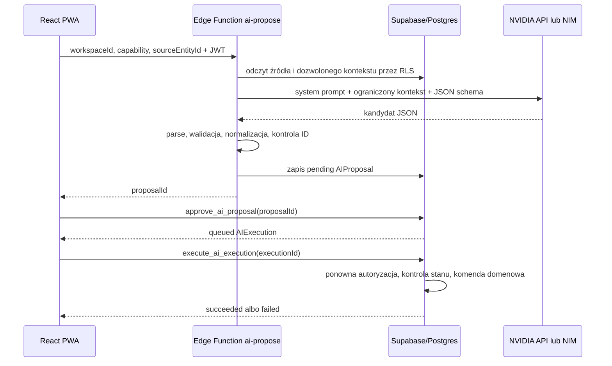

# Plan implementacji AI z obsługą NVIDIA

## Decyzja architektoniczna

Pierwszym wdrażanym przypadkiem użycia będzie **AI triage Inboxu**. Model nie
otrzymuje prawa do wykonywania komend ani zapisu encji. Jego jedynym wynikiem
jest typowana, wygasająca `AIProposal`, którą użytkownik może zatwierdzić albo
odrzucić. Dopiero osobna `AIExecution` wykonuje dozwoloną komendę domenową.

Integracja z modelem działa przez mały adapter OpenAI-compatible. Dzięki temu
ten sam kod obsługuje:

- chmurowy NVIDIA API Catalog pod `https://integrate.api.nvidia.com/v1`;
- własny NVIDIA NIM z adresem konfigurowanym przez środowisko;
- w przyszłości innego dostawcę bez zmiany logiki domenowej i UI.

W MVP adapter używa natywnego `fetch` w Supabase Edge Function. Nie dokładamy
Vercel AI SDK: nie ma tu jeszcze czatu, strumieniowania ani pętli narzędziowej,
a pojedyncze wywołanie OpenAI-compatible jest małe i łatwe do przetestowania.
SDK można wprowadzić później dla strumieniowanego tutora lub asystenta Focus.

## Zakres pierwszego wydania

Użytkownik wybiera nieprzetworzony element Inboxu i klika „Podpowiedz z AI”.
AI proponuje jeden z trzech istniejących rezultatów:

1. utworzenie Celu, opcjonalnie z pierwszym Działaniem;
2. utworzenie Działania, opcjonalnie przypisanego do istniejącego Celu lub
   Obszaru;
3. utworzenie elementu Wiedzy (`note`, `resource`, `decision`, `artifact` albo
   `investigation`), opcjonalnie połączonego z Celem.

Po otrzymaniu wyniku użytkownik widzi źródło, proponowane zmiany, uzasadnienie,
pewność modelu, dostawcę i model. Może:

- zatwierdzić propozycję, a następnie jawnie ją wykonać;
- odrzucić ją;
- wybrać „Edytuj ręcznie”, co odrzuca propozycję i wypełnia istniejący formularz
  triage danymi z AI.

Po wykonaniu powstają te same encje co przy ręcznym triage, Inbox Item przechodzi
do `resolved`, a oryginalna treść pozostaje w historii.

Poza MVP pozostają: ogólny chat, autonomiczne narzędzia, automatyczne wykonywanie
propozycji, RAG po całej Wiedzy, embeddings oraz wysyłanie plików do modelu.
Plan nie przywraca historycznego modelu Focus Session/Checkpoint; AI wspiera
aktualny układ Projekt → Cel → Działanie → Wiedza.

## Przepływ techniczny



Nie przesyłamy do Edge Function gotowego kontekstu z przeglądarki. Przeglądarka
podaje tylko identyfikator Workspace, capability i źródła. Funkcja sama pobiera
dane przez klienta ograniczonego RLS, dzięki czemu użytkownik nie może dołączyć
danych z innego Workspace ani podmienić listy dozwolonych Celów.

## Kontrakt Edge Function

Endpoint:

```text
POST /functions/v1/ai-propose
Authorization: Bearer <user JWT>
```

Request:

```json
{
  "workspaceId": "uuid",
  "capability": "triage_inbox",
  "sourceEntityId": "uuid"
}
```

Response `201`:

```json
{
  "proposalId": "uuid",
  "status": "pending"
}
```

Funkcja ma `verify_jwt = true` i używa uwierzytelnienia użytkownika. Odczyty
wykonuje klientem respektującym RLS. Klienta administracyjnego wolno użyć tylko
do zapisu serwerowego rekordu `ai_runs` i `ai_proposals`, po wcześniejszym
sprawdzeniu użytkownika, członkostwa Workspace i źródła.

Wspólne kody błędów:

- `AI_NOT_CONFIGURED` — brak wymaganych zmiennych NVIDIA;
- `AI_RATE_LIMITED` — przekroczony limit Workspace/użytkownika;
- `SOURCE_NOT_AVAILABLE` — element nie istnieje albo nie jest `unprocessed`;
- `PROVIDER_TIMEOUT` — przekroczony limit czasu;
- `PROVIDER_REJECTED` — NVIDIA zwróciła błąd 4xx/5xx;
- `INVALID_MODEL_OUTPUT` — odpowiedź nie przeszła walidacji;
- `CONTEXT_TOO_LARGE` — dane wejściowe przekraczają jawny limit.

## Kontrakt odpowiedzi modelu

Model zwraca wyłącznie poniższy kształt. Identyfikatory nowych encji nie pochodzą
od modelu — generuje je Edge Function. Model może wskazać tylko istniejący
`goalId` albo `areaId` z listy przekazanej w kontekście.

```ts
type InboxTriageDraft = {
  intent: "goal" | "action" | "knowledge";
  title: string;
  rationale: string;
  confidence: "low" | "medium" | "high";
  outcome: string | null;
  firstActionTitle: string | null;
  detail: string | null;
  targetGoalId: string | null;
  targetAreaId: string | null;
  knowledgeKind:
    | "note"
    | "resource"
    | "decision"
    | "artifact"
    | "investigation"
    | null;
  pinnedToToday: boolean;
};
```

Po walidacji serwer mapuje draft do istniejącego `InboxTriageIntent`. Serwer:

- przycina teksty i egzekwuje maksymalne długości;
- usuwa pola niedozwolone dla wybranego wariantu;
- odrzuca ID, którego nie było w przekazanej liście;
- ustawia `sourceUrl` samodzielnie dla źródła typu link;
- generuje `goalId`, `actionId`, `knowledgeId` i `linkId` przez `crypto.randomUUID()`;
- nie ufa `risk`, nazwie komendy, źródłu ani ID zwróconym przez model.

Wysyłamy modelowi JSON Schema, jeżeli wybrany endpoint to wspiera, ale zawsze
wykonujemy własny `JSON.parse` i walidację. Własny NIM może używać
`guided_json`; dla modeli chmurowych tryb strukturalny jest konfigurowalny,
ponieważ obsługa dodatkowych parametrów może różnić się między modelami.

## Adapter NVIDIA

Konfiguracja tylko w sekretach Supabase Edge Functions:

```text
AI_PROVIDER=nvidia
NVIDIA_BASE_URL=https://integrate.api.nvidia.com/v1
NVIDIA_API_KEY=nvapi-...
NVIDIA_MODEL=meta/llama-3.3-70b-instruct
NVIDIA_AUTH_MODE=bearer
NVIDIA_STRUCTURED_MODE=prompt
AI_TIMEOUT_MS=20000
AI_MAX_INPUT_CHARS=12000
AI_DAILY_LIMIT=30
```

Model jest zmienną środowiskową, nie stałą w kodzie. Wskazany model jest
kandydatem startowym widocznym obecnie w katalogu NVIDIA; przed wdrożeniem trzeba
potwierdzić jego dostępność i zachowanie dla języka polskiego. Dla własnego NIM
`NVIDIA_BASE_URL` wskazuje jego `/v1`, a model pobieramy z `GET /v1/models`.

Adapter wysyła `POST {baseUrl}/chat/completions` z:

- nagłówkiem `Authorization: Bearer ...` tylko w trybie `bearer`;
- `stream: false` w MVP;
- niską temperaturą;
- ograniczeniem tokenów odpowiedzi;
- jednym system promptem i jednym komunikatem użytkownika;
- timeoutem przez `AbortSignal.timeout` albo `AbortController`.

Interfejs adaptera:

```ts
interface AIProvider {
  generateObject(input: {
    model: string;
    system: string;
    prompt: string;
    schema: Record<string, unknown>;
  }): Promise<{
    value: unknown;
    providerRequestId?: string;
    inputTokens?: number;
    outputTokens?: number;
  }>;
}
```

NVIDIA NIM wystawia OpenAI-compatible `/v1/chat/completions`, obsługuje streaming
i — zależnie od backendu/profilu — structured generation. Chmurowy katalog używa
endpointu `https://integrate.api.nvidia.com/v1/chat/completions` z kluczem
Bearer. Dokumentacja referencyjna:

- [NVIDIA NIM API Reference](https://docs.nvidia.com/nim/large-language-models/latest/reference/api-reference.html)
- [NVIDIA API Catalog LLM APIs](https://docs.api.nvidia.com/nim/reference/llm-apis)
- [NVIDIA structured generation](https://docs.nvidia.com/nim/large-language-models/1.15.0/structured-generation.html)
- [Supabase Edge Function authentication](https://supabase.com/docs/guides/functions/auth)
- [Supabase Edge Function secrets](https://supabase.com/docs/guides/functions/secrets)

Własnego NIM nie wystawiamy publicznie bez uwierzytelnienia. Jeśli funkcja
Supabase ma go wywoływać, NIM musi być osiągalny po HTTPS i zabezpieczony bramą
lub reverse proxy akceptującym sekret Bearer. `NVIDIA_AUTH_MODE=none` nadaje się
wyłącznie do kontrolowanej sieci, w której działa również backend wywołujący.

## Zmiany w bazie

Nowa migracja powinna zostać utworzona przez `supabase migration new
add_ai_generation_pipeline`. Nie należy ręcznie wymyślać numeru migracji.

### `ai_proposals`

Pozostawiamy istniejące `command_name`, `command_args`, `preview_diff`,
`source_entity_ids`, `risk`, `expected_versions`, `status` i `expires_at`.
Dodajemy:

- `created_by uuid references auth.users(id)` — nullable wyłącznie dla danych
  historycznych, wymagane przez nowy zapis serwerowy;
- `capability text not null` z allowlistą `triage_inbox` w pierwszym wydaniu;
- `provider text not null`;
- `model text not null`;
- `prompt_version integer not null`;
- `generation_run_id uuid` wskazujące `ai_runs`.

Ponieważ tabela może już zawierać rekordy, migracja dodaje te kolumny najpierw
jako nullable, oznacza stare rekordy `provider = 'legacy'`, `model = 'unknown'`,
`prompt_version = 0`, a dopiero potem ustawia `NOT NULL` tam, gdzie da się
jednoznacznie zachować zgodność. `created_by` pozostaje nullable dla rekordów
historycznych, ale nowy serwerowy insert zawsze wymaga użytkownika. Nie
przypisujemy historycznej propozycji przypadkowemu członkowi Workspace.

Wartość `command_name` dla pierwszego przypadku to zawsze
`triage_inbox_intent`. `command_args` zawiera tylko oczyszczony, kompletny
`target_intent` i identyfikator źródła. `preview_diff` jest JSON-em przeznaczonym
do renderowania, a nie HTML-em.

Propozycja wygasa po 30 minutach. Nowa propozycja dla tego samego źródła oznacza
poprzednią oczekującą jako `superseded`.

Bezpośredni `INSERT` do `ai_proposals` dla roli `authenticated` zostaje cofnięty.
Propozycje zapisuje wyłącznie warstwa serwerowa po walidacji wyniku modelu.
Odczyt nadal podlega RLS członkostwa Workspace.

### `ai_runs`

Nowa tabela operacyjna przechowuje metadane bez treści promptów:

- `id`, `workspace_id`, `user_id`, `capability`;
- `provider`, `model`, `prompt_version`;
- `status`: `running | succeeded | failed`;
- `input_chars`, `input_tokens`, `output_tokens`, `latency_ms`;
- `provider_request_id`, `error_code`, `created_at`, `finished_at`.

Rola `authenticated` może czytać rekordy swojego Workspace, ale nie może ich
tworzyć, zmieniać ani usuwać. Tabela ma RLS oraz jawne granty, ponieważ nowe
tabele w `public` nie muszą być automatycznie wystawiane przez Data API.
Limit dzienny liczymy po `ai_runs`, uwzględniając `running` i `succeeded`.

Dodajemy indeksy pod rzeczywiste odczyty:

- `ai_runs (workspace_id, user_id, created_at desc)`;
- `ai_proposals (workspace_id, status, created_at desc)`;
- `ai_executions (workspace_id, status, created_at desc)`.

### Wykonanie

Dodajemy publiczną funkcję `execute_ai_execution(target_execution_id uuid)`,
która deleguje do prywatnej, jawnie zabezpieczonej funkcji komendowej. Funkcja w
jednej transakcji:

1. sprawdza `auth.uid()`;
2. blokuje `AIExecution` i powiązaną `AIProposal` przez `FOR UPDATE`;
3. sprawdza członkostwo Workspace, `approved`, `queued` i brak wygaśnięcia;
4. dopuszcza wyłącznie `command_name = 'triage_inbox_intent'`;
5. ponownie waliduje wszystkie pola `command_args` i przynależność wskazanych
   Celów/Obszarów do Workspace;
6. sprawdza, czy źródło nadal ma status `unprocessed`;
7. wykonuje atomowy triage z identyfikatorem wykonania jako kluczem
   idempotencji;
8. ustawia status `succeeded` albo zapisuje stabilny `error_code`;
9. dodaje `ActivityEvent` ze źródłem `ai` i correlation ID wykonania.

Żeby nie kopiować SQL triage, istniejącą funkcję warto rozdzielić na prywatny
helper przyjmujący `event_source` oraz dwa kontrolowane wejścia: obecne RPC dla
użytkownika z `event_source = 'user'` i executor AI z `event_source = 'ai'`.
Każda funkcja `SECURITY DEFINER` ma pusty `search_path`, własne sprawdzenie
użytkownika i Workspace oraz odebrane `EXECUTE` od `PUBLIC` i `anon`. Prywatna
funkcja komendowa pozostaje w niewystawionym schemacie `private` i może być
wywołana przez rolę `authenticated` tylko dlatego, że publiczny wrapper
`SECURITY INVOKER` deleguje do niej; wszystkie kontrole muszą więc pozostać w
funkcji prywatnej. To zachowuje wzorzec już używany przez
`approve_ai_proposal`/`reject_ai_proposal`.

## Pliki do dodania

```text
supabase/functions/ai-propose/index.ts
supabase/functions/_shared/ai/provider.ts
supabase/functions/_shared/ai/nvidia.ts
supabase/functions/_shared/ai/triage-schema.ts
supabase/functions/_shared/ai/triage-prompt.ts
supabase/functions/_shared/ai/context.ts
supabase/functions/_shared/http.ts
supabase/functions/tests/ai-propose.test.ts
apps/web/src/components/AIProposalCard.tsx
apps/web/src/components/AIProposalCard.test.tsx
apps/web/src/domain/ai.ts
apps/web/src/domain/ai.test.ts
```

## Pliki do zmiany

- `supabase/config.toml` — konfiguracja `ai-propose` z `verify_jwt = true`;
- nowa migracja — `ai_runs`, metadane propozycji, polityki, granty i executor;
- `apps/web/src/domain/types.ts` — pełny model propozycji, wykonania i preview;
- `apps/web/src/data/supabaseRepository.ts` — pełne mapowanie propozycji i
  wykonań, invoke Edge Function oraz RPC wykonania;
- `apps/web/src/app/store-context.ts` i `apps/web/src/app/store.tsx` — asynchroniczne
  `requestAIProposal`, `approveAIProposal`, `rejectAIProposal` i
  `executeAIExecution`;
- `apps/web/src/pages/InboxPage.tsx` — wejście „Podpowiedz z AI” i obsługa stanu;
- `apps/web/src/components/RightRail.tsx` — renderowanie prawdziwego
  `preview_diff`, bez obecnego tekstu demonstracyjnego;
- testy migracji, repozytorium i Store.

## Kontekst wysyłany do modelu

Pierwsza wersja wysyła tylko:

- rodzaj i treść jednego Inbox Itemu, maksymalnie 8 000 znaków;
- aktywne Cele: `id`, `title`, skrócony `outcome`, maksymalnie 30;
- aktywne Obszary: `id`, `name`, maksymalnie 20;
- język Workspace i reguły rozpoznawania intencji.

Nie wysyłamy innych elementów Inboxu, scratchpadów, pełnej Wiedzy, historii
Focus, danych użytkownika ani sekretów. Link jest traktowany jako tekst URL;
MVP nie pobiera treści strony internetowej.

Treść użytkownika znajduje się w wyraźnie oznaczonym polu danych. Prompt
instruuje model, że pole może zawierać polecenia, które należy klasyfikować, a
nie wykonywać. Najważniejszą ochroną pozostaje jednak allowlista i walidacja po
stronie serwera, nie sam prompt.

## UI i stany

Każdy element Inboxu może mieć jeden z widocznych stanów AI:

- brak propozycji;
- generowanie z możliwością anulowania widoku;
- propozycja oczekująca;
- zatwierdzona i oczekująca na wykonanie;
- wykonywana;
- wykonana;
- odrzucona, wygasła albo nieudana.

`AIProposalCard` pokazuje strukturalny diff: „utworzy” i „zmieni”, a nie surowy
JSON. UI nie renderuje HTML-a zwróconego przez model. Po sukcesie Store wykonuje
refetch Workspace. Po błędzie pozostawia rekord i pokazuje stabilny komunikat z
opcją ponowienia tylko wtedy, gdy operacja jest idempotentna.

### Tryb demo

Tryb demo zachowuje ten sam kontrakt UI i stanów, ale nie wywołuje NVIDIA.
`requestAIProposal` używa deterministycznego generatora fixture opartego na
rodzaju źródła i zapisuje lokalną `AIProposalRecord`. Akceptacja i wykonanie
przechodzą przez istniejące komendy domenowe. Karta wyraźnie pokazuje
`provider = demo`, żeby użytkownik nie pomylił symulacji z prawdziwą analizą.
Pozwala to testować cały pion offline i spełnia zasadę zgodności trybu demo z
kontraktem Supabase.

## Testy

### Domena i parser

- każdy wariant `InboxTriageDraft` przechodzi walidację;
- brak wymaganych pól, dodatkowe pola, zły enum i za długi tekst są odrzucane;
- nieznany `goalId`/`areaId` jest odrzucany;
- source URL jest wyprowadzany z Inboxu, nie z odpowiedzi modelu;
- prompt injection w treści nie może zmienić command name ani source ID;
- błędny JSON powoduje najwyżej jedną próbę naprawy, potem kontrolowany błąd.

### Edge Function

- brak JWT daje 401;
- użytkownik spoza Workspace nie dostaje informacji, czy źródło istnieje;
- element inny niż `unprocessed` nie uruchamia wywołania NVIDIA;
- timeout, 429, 4xx, 5xx i niepoprawny JSON są mapowane na stabilne kody;
- sekret NVIDIA nie trafia do odpowiedzi ani logów;
- limit dzienny jest egzekwowany przed wywołaniem dostawcy;
- testy używają lokalnego fałszywego serwera OpenAI-compatible, nie prawdziwego
  API NVIDIA.

### Migracje i RLS

- klient nie może bezpośrednio utworzyć lub zmienić propozycji ani wykonania;
- członek innego Workspace nie może czytać `ai_runs`, propozycji i wykonań;
- niezatwierdzona, wygasła, odrzucona albo już wykonana propozycja nie wykonuje
  komendy;
- podmieniony target ID lub command name jest odrzucany;
- dwa wywołania execute tworzą jeden rezultat;
- zmiana stanu źródła między propozycją a wykonaniem kończy się kontrolowanym
  konfliktem;
- ActivityEvent ma `source = 'ai'` i właściwe correlation ID.

### Frontend

- generowanie blokuje podwójne kliknięcie;
- karta pokazuje prawdziwy diff i metadane;
- approve, reject, edit manually i execute wywołują właściwe operacje;
- błąd nie ustawia lokalnie fałszywego `succeeded`;
- po refetch element przechodzi do przetworzonych i pojawia się utworzona encja.
- tryb demo przechodzi ten sam flow na deterministycznej propozycji bez żądania
  sieciowego.

## Etapy wdrożenia

### Etap 0 — spike NVIDIA, 0,5 dnia

- utworzyć klucz API NVIDIA w środowisku developerskim;
- wybrać dwa aktualnie dostępne modele z katalogu;
- uruchomić 20 reprezentatywnych polskich przykładów triage;
- zmierzyć poprawność JSON, trafność intencji, latency i liczbę tokenów;
- wybrać model przez konfigurację, nie przez zmianę kodu.

Warunek przejścia: co najmniej 18/20 odpowiedzi przechodzi parser bez naprawy i
żadna nie wskazuje ID spoza przekazanego kontekstu.

### Etap 1 — pion backendowy, 1,5–2 dni

- migracja i testy RLS;
- adapter NVIDIA i lokalny fake provider;
- Edge Function `ai-propose`;
- zapis prawdziwej propozycji;
- executor używający istniejącej komendy triage;
- test całego przepływu create → approve → execute.

Warunek przejścia: przepływ działa bez frontendu przez invoke/RPC, jest
idempotentny i przechodzi testy migracji.

### Etap 2 — UI, 1–1,5 dnia

- pełne mapowanie propozycji i wykonań w repozytorium;
- `AIProposalCard`;
- wejście z Inboxu i poprawiony RightRail;
- stany loading/error/retry oraz ścieżka „Edytuj ręcznie”;
- testy Store i komponentów.

Warunek przejścia: użytkownik może ukończyć cały przepływ na desktopie i mobile,
a UI nie symuluje statusu wykonania.

### Etap 3 — operacje i wdrożenie, 0,5–1 dnia

- ustawić sekrety osobno dla staging i produkcji;
- wdrożyć migrację i Edge Function najpierw na staging;
- wykonać smoke test z prawdziwym API NVIDIA;
- sprawdzić logi bez promptów i sekretów;
- ustawić niski limit dzienny i alert na wzrost błędów/provider latency;
- uruchomić lint, typecheck, testy, build i testy RLS.

Łącznie MVP: około **3,5–5 dni pracy** po uzyskaniu klucza NVIDIA.

## Kryteria odbioru MVP

- klucz NVIDIA nie występuje w `VITE_*`, bundlu przeglądarki, bazie ani logach;
- tylko zalogowany członek Workspace może zlecić analizę własnego źródła;
- model nie może wybrać dowolnej komendy ani samodzielnie jej wykonać;
- propozycja ma czytelny diff, źródła, ryzyko, model, prompt version i termin
  wygaśnięcia;
- akceptacja i wykonanie są osobnymi, audytowalnymi operacjami;
- wykonanie jest atomowe i idempotentne;
- źródło zmienione po wygenerowaniu propozycji powoduje konflikt, nie cichy zapis;
- cloud NVIDIA i własny NIM różnią się tylko konfiguracją adaptera;
- awaria lub brak konfiguracji AI nie blokuje ręcznego triage Inboxu.

## Kolejne piony po MVP

1. **AI Weekly Review** — tylko draft podsumowania i 2–3 sugestie, bez
   automatycznych zmian.
2. **AI Goal Shaping** — propozycja mierzalnego rezultatu, kryteriów i pierwszego
   Działania dla istniejącego Projektu lub Celu.
3. **AI Action Breakdown** — rozbicie zbyt szerokiego Działania na krótką listę
   kroków z zachowaniem WIP i wskazaniem jednego następnego kroku.
4. **AI Knowledge Assist** — streszczenie materiału i propozycje powiązań z
   Projektami, Celami i Działaniami, nadal zatwierdzane przez użytkownika.
5. **Knowledge retrieval** — dopiero wtedy embeddings, wyszukiwanie semantyczne
   i ograniczony RAG; osobny model embeddingowy NVIDIA i osobna polityka retencji.
6. **Tutor/Chat** — streaming, historia rozmowy i ewentualne wprowadzenie AI SDK,
   ale nadal bez niezatwierdzonych zapisów domenowych.
