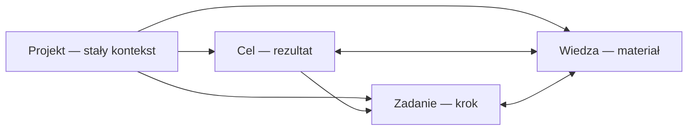

# Hierarchia produktu — trwałe Projekty i proste Cele

**Status:** wdrożone  
**Data:** 2026-08-07  
**Zastępuje:** założenie, że jeden model Celu pełni również rolę Projektu

## Decyzja

Projekt jest trwałym kontenerem kontekstu. Nie ma pojedynczego warunku
ukończenia i może przez długi czas zbierać kolejne rezultaty oraz materiały.

Cel jest prostszą jednostką wykonania: nazywa konkretny rezultat, który można
osiągnąć, wstrzymać albo porzucić. Zadanie jest pojedynczym krokiem, a Wiedza
zachowuje materiały, notatki i decyzje niezależnie od bieżącego Celu.

## Nawigacja

- **Projekty** i **Cele** są osobnymi pozycjami głównej nawigacji.
- Widok Projektu ma zakładki Przegląd, Cele, Zadania i Wiedza.
- Cel można utworzyć samą nazwą; wynik, pierwsze Zadanie i kryteria są
  opcjonalne.
- Kryteria i szablony pozostają dostępne jako opcje zaawansowane.

## Kompatybilność danych

- Nowy Projekt korzysta z istniejącego rekordu `areas`; zmiana nazwy produktu
  nie tworzy równoległej tabeli ani nie usuwa danych.
- Historyczne rekordy `projects` są addytywnie odwzorowywane do trwałych
  Projektów o tych samych identyfikatorach.
- Wiedza może być powiązana bezpośrednio z Projektem przez `area_id` w
  `knowledge_links`.
- Dotychczasowe relacje Celów, Zadań i Wiedzy pozostają zachowane.
