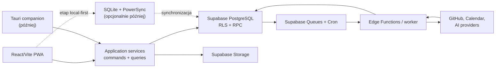

# Centrum dowodzenia developera — research i rekomendacja architektury

Data decyzji: 2026-07-30

## 1. Decyzja w skrócie

Najlepszym punktem startu nie jest ani klasyczny task manager, ani luźny system notatek, ani autonomiczny agent AI. Produkt powinien być **systemem prowadzenia pracy i nauki**, opartym na jednym obiegu:

> Capture → Shape → Commit → Focus → Checkpoint → Review.

`Context Checkpoint` utrzymuje ciągłość pracy. `Learning Evidence` jest
opcjonalnym wynikiem sesji realizującej cel nauki, a nie osobnym etapem tej
pętli.

Rekomendowana architektura pierwszej wersji:

- aplikacja **cloud-first, offline-tolerant**, ale przygotowana do późniejszego local-first;
- frontend **React + TypeScript + Vite jako PWA**, możliwy do osadzenia później w Tauri;
- **Supabase** jako PostgreSQL, Auth, Storage, Realtime, Queues i Cron;
- relacyjny modularny monolit z typowanymi obiektami domenowymi;
- wspólny rejestr obiektów i tabela relacji jako lekki graf;
- dziennik aktywności i outbox, ale bez pełnego event sourcingu;
- AI jako warstwa proponująca typowane komendy, bez bezpośredniego prawa zapisu;
- development aplikacji przeciw zarządzanemu stagingowi, izolowane testy migracji w PGlite/PostgreSQL oraz produkcja w osobnym projekcie Supabase, dopóki charakter danych i wymagania dostępności pozwalają korzystać z Free.

Najważniejsza decyzja produktowa: aplikacja ma zmniejszać koszt powrotu do kontekstu i pomagać kończyć rzeczy. Nie może premiować rozbudowy systemu, liczby notatek, streaków ani godzin spędzonych na „organizowaniu produktywności”.

## 2. Jakie procesy system powinien wspierać

### 2.1. Samoregulacja nauki

Badania nad self-regulated learning powtarzają cykl: ustalenie celu, planowanie, działanie, monitorowanie i refleksja. Sam dashboard nie wystarcza — dane muszą prowadzić do zmiany kolejnego działania. Przeglądy badań wskazują też wysoką użyteczność practice testing/retrieval practice i nauki rozłożonej w czasie, podczas gdy samo ponowne czytanie i podkreślanie są słabszymi strategiami ([Dunlosky et al.](https://pubmed.ncbi.nlm.nih.gov/26173288/), [przegląd SRL i learning analytics](https://link.springer.com/article/10.1007/s10639-022-11281-4)).

Przekład na funkcje:

- cel nauki musi określać oczekiwaną umiejętność lub rezultat, a nie tylko temat;
- przed rozpoczęciem ścieżki warto zapisać stan początkowy i luki;
- Focus Session realizująca cel nauki zawiera próbę odtworzenia wiedzy,
  ćwiczenie lub artefakt;
- po sesji zapisywane są: wynik, błędne założenia, feedback i następny krok;
- powtórki są planowane dla wiedzy wymagającej retencji, ale nie zastępują budowania;
- postęp jest liczony przez dowody: rozwiązane zadanie, projekt, test, wyjaśnienie, code review lub demonstrację.

Uczenie projektowe jest szczególnie sensowne w technologii i inżynierii, ale jego efekty zależą od konstrukcji zadania, feedbacku i czasu trwania. System powinien zatem łączyć temat nauki z konkretnym projektem i mierzalnym artefaktem, zamiast tworzyć osobne silosy „kursy” i „projekty” ([meta-analiza project-based learning](https://pubmed.ncbi.nlm.nih.gov/37564309/)).

### 2.2. Ograniczanie przełączania kontekstu

Badania pracy programistów pokazują, że zakłócenie zależy nie tylko od samej liczby przerw, ale od rodzaju przerwania, zadania i momentu zmiany. Samodzielne przełączanie zadań również może być bardzo kosztowne ([badanie 4 910 zadań programistycznych](https://arxiv.org/abs/1805.05508)).

Dlatego system potrzebuje:

- limitu aktywnej pracy w toku: domyślnie trzech aktywnych Commitments, z których
  dokładnie jeden jest Primary Commitment;
- konkretnego `WorkItem` opisującego następny fizyczny krok, a nie wyłącznie
  ogólnego statusu;
- checkpointu przy zatrzymaniu pracy: gdzie skończyłem, co działa, co nie działa, jaki plik/branch otworzyć, co zrobić jako pierwsze;
- „context pack” projektu: aktywne wymaganie, decyzje, linki, repozytorium, ostatnia sesja i blokery;
- grupowania drobnych zadań administracyjnych, aby nie rozbijały pracy głębokiej;
- widoku rzeczy faktycznie aktywnych, bez mieszania ich z całym backlogiem.

Najważniejszą miarą produktu powinien być **czas potrzebny do odzyskania kontekstu**, a nie czas spędzony w aplikacji.

### 2.3. Zarządzanie projektami i wymaganiami

Z Kanbanu warto przejąć wizualizację przepływu, jawne zasady i limity WIP, ale nie trzeba kopiować całej metodyki ([oficjalny Kanban Guide](https://kanban.university/kanban-guide/)). Z Shape Up warto przejąć:

- shaping przed podjęciem zobowiązania;
- appetite ze Shape Up, nazwany w produkcie `Effort Budget`, czyli opcjonalny
  limit inwestowanej pracy zamiast pozornie precyzyjnej estymacji;
- opis ryzyk, rabbit holes i rzeczy celowo wyłączonych;
- stały czas i zmienny zakres;
- rozdzielenie surowych pomysłów od pracy gotowej do realizacji.

Sześciotygodniowe cykle Shape Up nie powinny być wymaganiem. Dla jednej osoby sensowniejsze są elastyczne cykle 1–4 tygodni, zależne od typu przedsięwzięcia. Warto zachować zasadę, a nie rytuał ([oficjalne Shape Up](https://basecamp.com/shapeup)).

Surowa potrzeba pozostaje `InboxItem` podczas capture i clarifying. `Requirement`
powstaje dopiero podczas shaping jednego konkretnego projektu i ma prosty cykl:

1. `proposed` — rozważane w zakresie projektu;
2. `accepted` — należy do aktualnego zakresu;
3. `validated` — posiada konkretny dowód spełnienia;
4. `rejected` — świadomie nie należy do zakresu;
5. `superseded` — zostało zastąpione nowszym wymaganiem.

Requirement nie ma własnego planu, Effort Budget ani sesji. Musi dać się prześledzić
do decyzji, Work Itemu, artefaktu, testu oraz dowodu walidacji. Należy do
dokładnie jednego projektu; regułę przekrojową należy modelować jako nadrzędną
zasadę lub ograniczenie, a nie współdzielony rekord Requirement.

### 2.4. Zarządzanie wiedzą

Najbardziej użyteczny wzorzec z narzędzi takich jak Capacities to obiekty typowane zamiast głębokich folderów. Daily note lub Inbox obniża koszt przechwycenia, a struktura powstaje dopiero podczas późniejszego przeglądu ([Capacities: object types](https://docs.capacities.io/reference/content-types), [daily notes](https://docs.capacities.io/reference/use-cases/daily-notes)).

Rekomendacje:

- pojedynczy Inbox jako punkt wejścia dla tekstu, linku, pliku, głosu i importu;
- typy takie jak Project, Requirement, Investigation, Skill, LearningGoal,
  Resource, Note, Decision i Artifact;
- tagi tylko do przekrojowych tematów, nie do odtwarzania hierarchii;
- relacje między obiektami zamiast kopiowania tej samej treści do wielu miejsc;
- zapis treści w Markdown w MVP;
- bez block-level transclusion i złożonego edytora blokowego w pierwszej wersji;
- jawny eksport Markdown/JSON/CSV oraz regularny `pg_dump`.

`InboxItem` pozostaje zachowaną kopertą surowego capture również po triage.
Przechowuje oryginalną treść, źródło, czas, załączniki i transkrypcję, a jego
stany to `unprocessed`, `snoozed`, `resolved` i `discarded`. Triage może utworzyć
lub powiązać wiele obiektów docelowych bez zmiany typu InboxItemu. Klasyfikacja
AI jest wyłącznie propozycją, a hard delete podlega osobnej polityce retencji.

### 2.5. Osobista informatyka i przeglądy

Modele personal informatics opisują przepływ: przygotowanie, zbieranie, integracja, refleksja i działanie. Sama wizualizacja nie gwarantuje wglądu ani zmiany zachowania ([przegląd personal informatics](https://www.tandfonline.com/doi/full/10.1080/07370024.2016.1276456)).

Dlatego przegląd tygodniowy nie powinien być raportem oglądalności. Powinien kończyć się decyzjami:

- co kontynuować, zatrzymać lub usunąć;
- które Commitments przekraczają limit WIP;
- gdzie nie ma następnego kroku;
- które wymagania są osierocone;
- czego nauczyły ostatnie sesje;
- co trafi do następnego cyklu;
- jaki jest największy obecnie brak wiedzy lub ryzyko.

## 3. Proponowany model produktu

### 3.1. Główne widoki

1. **Command** — Focus, Today, Inbox, blokery, powtórki i najbliższe zobowiązania.
2. **Projects** — outcomes, requirements, plan, zadania, decyzje, artefakty i stan projektu.
3. **Learning** — cele, kompetencje, tematy, materiały, sesje, ćwiczenia i dowody.
4. **Knowledge** — notatki, zasoby, wyszukiwanie i powiązania.
5. **Review** — przegląd dzienny, tygodniowy i cykliczny.
6. **Integrations** — GitHub, kalendarz, pliki i źródła capture.
7. **AI Command** — wyszukiwanie, podsumowania i propozycje działań.

Nie powinno być osobnych, konkurujących źródeł „dzisiejszych zadań”. Command jest
projekcją aktywnych Commitments, Work Items, sesji i terminów, a nie kolejną
listą ani osobnym planem.

### 3.2. Najważniejsze obiekty

- `Workspace`, `Membership`, `Area`;
- `Entity` — wspólny identyfikator i typ;
- `Project`, `Requirement`, `Commitment`, `WorkItem`, `Investigation`;
- `Skill`, `LearningGoal`, `LearningEvidence`;
- `Note`, `Resource`, `Decision`, `Artifact`;
- `FocusSession`, `ContextCheckpoint`, `Review`;
- `InboxItem`, `EntityLink`, `ActivityEvent`;
- `ExternalReference`, `IntegrationConnection`;
- `AIProposal`, `AIExecution`, `OutboxMessage`.

`Conclusion` jest częścią `Investigation`, a nie osobnym typem `Entity`.
Zawiera aktualną odpowiedź, poziom pewności i źródła. Osobny obiekt `Finding`
nie należy do MVP; `Decision` powstaje dopiero wtedy, gdy odpowiedź prowadzi do
wyboru kierunku działania.

`Decision` jest niezmiennym zapisem istotnego wyboru i jego uzasadnienia, nie
rejestrem każdej operacji. Zawiera kontekst, wybrany kierunek, opcjonalne
alternatywy oraz źródłowe Conclusions. Zmiana kierunku tworzy nowe Decision
wskazujące poprzednie jako `superseded`; zwykłe zmiany statusów i decyzje Review
trafiają do ActivityEvent. Draft AI wymaga akceptacji użytkownika.

`Investigation` ma cykl `draft → shaped → concluded | abandoned`. `concluded`
wymaga Conclusion ze źródłami i poziomem pewności, ale nie wymaga Decision.
Nowe dowody mogą ponownie otworzyć rekord do `shaped`, zachowując poprzednią
Conclusion w historii; istotna zmiana pytania tworzy nowe Investigation.
Aktywność i wstrzymanie wynikają wyłącznie z Commitmentu.

`LearningGoal` ma cykl `draft → shaped → achieved | abandoned`. `shaped` wymaga
powiązania co najmniej jednego Skill i kryterium demonstracji; `achieved` wymaga
zaakceptowanego LearningEvidence spełniającego to kryterium i ustawia otwarty
Commitment na `fulfilled`. Spadek retencji nie cofa historycznego osiągnięcia,
lecz tworzy nowy cel powtórki lub wyższego poziomu.

`LearningEvidence` jest niezmiennym zapisem próby z wynikiem `supports`,
`reveals_gap` albo `inconclusive`, kryterium i sposobem oceny. Może wskazywać
Artifact, ale sam artefakt, czas nauki, ukończenie materiału lub streak nie są
dowodem. Ocena AI wymaga zatwierdzenia użytkownika, chyba że kryterium sprawdził
deterministyczny test. Każda kolejna próba tworzy nowy rekord.

`Review` jest niezmiennym zapisem procesu decyzyjnego typu `daily` albo
`weekly`. Pytania są wersjonowanym szablonem UI, nie encjami `ReviewCard`.
Review wykonuje zmiany przez zwykłe komendy domenowe i zapisuje odpowiedzi,
podsumowanie oraz identyfikatory wykonanych komend bez kopiowania zadań lub
planów. Korekta wymaga nowego Review; typ cykliczny pozostaje poza MVP.

`Outcome` jest obowiązkową częścią `Project`, a nie osobnym typem `Entity`.
Projekt ma dokładnie jeden aktualny outcome; niezależnie osiągalne rezultaty
powinny zostać rozdzielone na osobne projekty. Utworzenie `Commitment` wymaga
outcome i najważniejszych ograniczeń; `Effort Budget` pozostaje opcjonalny.
Istotna zmiana outcome wraca do shaping i pozostawia wpis w historii.

`Project` ma cykl `draft → shaped → validating → completed | abandoned`.
Aktywność i wstrzymanie wynikają wyłącznie z Commitmentu, nie ze statusu
projektu. `completed` wymaga osiągnięcia outcome i walidacji zaakceptowanych
Requirements oraz ustawia otwarty Commitment na `fulfilled`; `abandoned`
ustawia go na `released`. Archiwizacja jest osobnym stanem widoczności.

Generyczny `Plan` nie należy do modelu MVP. `Commitment` wskazuje dokładnie jeden
ukształtowany `Project`, `Investigation` albo `LearningGoal`, opcjonalnie zapisuje
`Effort Budget` i dopuszcza rezultat do aktywnego WIP. Jeden rezultat może mieć
wiele historycznych Commitments, ale najwyżej jeden otwarty (`active` albo
`paused`). Today i Week są
projekcjami Commitments i Work Items; `Cycle` pozostaje poza MVP.

`Effort Budget` jest limitem skupionej pracy lub liczby sesji, a nie estymacją
ani deadline'em. Zużywają go wyłącznie Focus Sessions, których Work Item ma
rezultat Commitmentu jako kontekst główny; relacje dodatkowe nie naliczają pracy
ponownie. Po wyczerpaniu budżetu Commitment wymaga decyzji: zwiększ budżet,
ogranicz zakres, wstrzymaj albo zakończ.

Workspace ma konfigurowalny limit WIP równy domyślnie trzem aktywnym
Commitments. Jeśli WIP nie jest pusty, dokładnie jeden aktywny rekord jest
Primary Commitment i dominuje w Command. Wstrzymane Commitments nie zużywają
limitu. Przekroczenie limitu nie jest technicznie blokowane, ale wymaga jawnego
nadpisania i krótkiego uzasadnienia.

Commitment ma stan `active`, `paused`, `released` albo `fulfilled`. Wznowienie
`paused` zachowuje ten sam rekord; `released` zamyka zobowiązanie bez osiągnięcia
rezultatu, a `fulfilled` po jego osiągnięciu. `needs_review` jest flagą wyliczaną
z Effort Budget lub braku aktywności, nie piątym stanem. Tylko `active` może być
Primary Commitment.

Wzorzec `Entity` + osobne tabele szczegółowe daje jeden stabilny identyfikator dla relacji i zdarzeń, ale zachowuje typy, ograniczenia i indeksy PostgreSQL. Jest bezpieczniejszy niż jedna tabela z dowolnym `jsonb` i bardziej elastyczny niż polimorficzne relacje bez kluczy obcych.

`ActivityEvent` jest append-only audytem udanych komend, a nie źródłem prawdy,
event sourcingiem ani analityką kliknięć. Zapisuje aktora, źródło, komendę,
obiekty, krótki diff i klucze korelacji bez pełnej treści lub sekretów. Undo
wykonuje komendę kompensującą. Nieudane próby trafiają do logów diagnostycznych,
a stan pozostaje w zwykłych tabelach domenowych.

### 3.3. Najważniejsze komendy

- `captureItem`
- `triageItem`
- `shapeProject`
- `createCommitment`
- `releaseCommitment`
- `startFocusSession`
- `endFocusSession`
- `recordLearningEvidence`
- `linkEntities`
- `completeReview`
- `createAIProposal`
- `approveAIProposal`
- `rejectAIProposal`

Komendy, które modyfikują kilka tabel, powinny być atomowymi funkcjami PostgreSQL/RPC. Każda komenda przyjmuje `idempotency_key`, jeśli może być wykonana z kolejki, integracji lub po odzyskaniu połączenia.

`startFocusSession` zawsze przyjmuje dokładnie jeden `work_item_id`. Szeroki
`Project`, `Investigation`, `LearningGoal`, `Area` albo `Skill` nie może być
bezpośrednim celem sesji. Szybki start z takiego kontekstu najpierw tworzy lub
wybiera konkretny `WorkItem`; zakończenie sesji nie kończy go automatycznie.
`WorkItem` może mieć `Area` jako główny kontekst dla pojedynczej pracy
operacyjnej, która nie uzasadnia tworzenia osobnego projektu.

WorkItem ma cykl `open → in_progress ↔ blocked → completed | cancelled`.
Pierwsza sesja zmienia `open` na `in_progress`, ale zakończenie sesji nie kończy
automatycznie Work Itemu. `in_focus` jest stanem wyliczanym z aktualnie trwającej
Focus Session. Work Item może pozostawać `in_progress` przez wiele sesji i być
aktualizowany również poza nimi; długo nieaktywny element jest sygnałem Review,
nie dodatkową jednostką WIP.

FocusSession jest jednym ciągłym przedziałem o stanie `running` albo `ended`.
Komenda `endFocusSession` zapisuje powód, np. `paused`, `work_item_completed`,
`stopped` albo `interrupted`. Pause kończy rekord, a Resume tworzy nową sesję dla
tego samego Work Itemu. Jeśli element pozostaje nieukończony, zakończenie wymaga
jednego ContextCheckpoint; awaria wymaga uzupełnienia go po powrocie albo
oznaczenia sesji jako nieważnej. User może mieć najwyżej jedną sesję `running` w
danym Workspace.

ContextCheckpoint wymaga tylko `current_state` i `next_action`. Blocker, branch,
plik, URL, Artifact oraz krótka notatka są opcjonalne lub uzupełniane przez
integrację. Rekord pozostaje edytowalny do rozpoczęcia kolejnej Focus Session dla
tego samego Work Itemu, a potem staje się niezmienny. Draft AI wymaga
zatwierdzenia użytkownika; scratchpad nie jest automatycznie Note ani
checkpointem.

SessionScratchpad jest treścią zależną od FocusSession, nie osobnym Entity. Jest
zachowywany z sesją, ale domyślnie nie trafia do Knowledge, globalnego
wyszukiwania ani późniejszego kontekstu AI. Użytkownik może promować jego fragment
do Note, InboxItem, Decision albo ContextCheckpoint, zachowując oryginał przy
sesji. Scratchpad nie jest automatycznie LearningEvidence.

## 4. Porównanie backendów i strategii danych

Poniższa macierz jest oceną decyzyjną 1–5 dla tego konkretnego produktu. Wagi: szybkość solo 15%, dopasowanie domenowe 20%, multi-device/offline 15%, przenośność 10%, koszt i operacje 15%, AI/integracje 15%, rozwój zespołowy 10%.

| Rozwiązanie | Wynik | Mocne strony | Największy koszt |
|---|---:|---|---|
| Supabase, modularny monolit | **4,50** | PostgreSQL, Auth, Storage, Realtime, Queue, Cron, RLS, pgvector | Brak prawdziwego local-first bez dodatkowej warstwy |
| Supabase + PowerSync od początku | 4,00 | Pełne lokalne SQLite i synchronizacja | Więcej schematów, reguł, kosztów i przypadków konfliktów |
| Convex | 3,85 | Bardzo szybki rozwój realtime, transakcje w TypeScript | Silniejszy lock-in i słabsze klasyczne SQL/reporting |
| Firebase/Firestore | 3,65 | Dojrzały offline i realtime | Model NoSQL gorzej pasuje do gęstych relacji i raportów |
| Neon + osobne usługi | 3,60 | PostgreSQL, branching, dużo projektów Free, przenośność | Trzeba osobno składać storage, kolejki, realtime i integracje |
| Turso/local SQLite + usługi | 3,60 | Niskie opóźnienia i dobra droga local-first | Więcej własnej platformy i mniej kompletne BaaS |
| Tylko desktop + SQLite | 3,55 | Prostota, prywatność, offline i brak kosztu chmury | Słabe multi-device, mobile capture i współpraca |

Supabase wygrywa nie dlatego, że każdy jego komponent jest najlepszy osobno, lecz dlatego, że ogranicza liczbę systemów, które jedna osoba musi utrzymywać. Każdy projekt dostarcza osobną instancję PostgreSQL i komplet usług. Free pozwala obecnie na dwa aktywne projekty, po 500 MB bazy każdy; projekty o niskiej aktywności mogą zostać wstrzymane ([billing](https://supabase.com/docs/guides/platform/billing-on-supabase), [pricing](https://supabase.com/pricing)).

Neon jest bardzo dobrą alternatywą, jeśli priorytetem stają się branch-per-preview i wiele środowisk: Free deklaruje obecnie do 100 projektów, 0,5 GB na projekt i skalowanie do zera. Nie zastępuje jednak całego zestawu Storage/Queues/Cron/Realtime w równie spójnym pakiecie ([Neon pricing](https://neon.com/pricing)).

Convex warto rozważyć, gdy najważniejszy jest wieloosobowy realtime i szybkość implementacji reaktywnego UI. Zapytania automatycznie śledzą zależności, a mutacje są transakcjami, lecz domena tego produktu mocno korzysta z relacyjnych zapytań, eksportu SQL i analityki ([Convex overview](https://docs.convex.dev/understanding/overview), [Realtime](https://docs.convex.dev/realtime)).

Firestore zapewnia działanie offline w oficjalnych klientach, ale jego model i rozliczanie operacji odczytu są mniej naturalne dla grafu relacji, raportów i złożonych filtrów tego systemu ([Firestore offline](https://firebase.google.com/docs/firestore/manage-data/enable-offline), [pricing](https://firebase.google.com/docs/firestore/pricing)).

## 5. Rekomendowana architektura techniczna



### 5.1. Frontend

Rekomendacja: React, TypeScript, Vite, PWA i TanStack Query.

Dlaczego nie Next.js jako domyślny fundament:

- SEO nie jest ważne dla zalogowanego centrum dowodzenia;
- większość najważniejszych ekranów jest wysoce interaktywna i klientowa;
- statyczny build łatwiej hostować i osadzić w Tauri;
- ten sam frontend może działać w webie i desktopie;
- Supabase zapewnia backend oraz autoryzację;
- unika się silnego związania podstawowego UX z granicą Server/Client Components.

Next.js nadal jest dobrym wyborem dla publicznej strony, dokumentacji lub późniejszego panelu administracyjnego. App Router domyślnie używa Server Components, a interaktywne fragmenty wymagają granicy `use client`; Server Actions są przeznaczone do mutacji ([Next.js docs](https://nextjs.org/docs/app)).

TanStack Query zapewni cache, optimistic updates i utrwalenie wybranych zapytań. Potrafi także zachować i wznowić zatrzymane mutacje, ale jest to **offline-tolerant**, nie pełny local-first: trzeba zdefiniować serializowalne komendy, domyślne mutation functions oraz reguły ponawiania ([TanStack Query: offline queries and mutations](https://tanstack.com/query/latest/docs/framework/react/guides/network-mode)).

### 5.2. Organizacja kodu

Rekomendowany workspace:

```text
apps/
  web/                  React/Vite PWA
  desktop/              Tauri, dopiero gdy potrzebny
packages/
  domain/               typy, walidacja i reguły
  application/          komendy, query services, use cases
  data/                 Supabase repositories i mapowanie DTO
  ui/                   współdzielone komponenty
  integrations/         kontrakty adapterów
supabase/
  migrations/
  functions/
  seed.sql
docs/
  adr/
  research/
```

W MVP wystarczy pnpm workspace. Turborepo lub Nx należy dodać dopiero, gdy czas buildów i liczba pakietów uzasadnią dodatkową konfigurację.

### 5.3. Supabase i bezpieczeństwo danych

- Wszystkie rekordy użytkownika zawierają `workspace_id`.
- `workspace_members` jest źródłem autoryzacji.
- Każda tabela w schemacie udostępnionym przez Data API ma włączone RLS.
- Polityki sprawdzają członkostwo/rolę, nie samo `TO authenticated`.
- `service_role` i secret keys nigdy nie trafiają do klienta.
- Widoki dostępne klientowi używają `security_invoker`.
- Funkcje RPC domyślnie działają jako `security invoker`; `security definer` tylko dla dokładnie uzasadnionych operacji w prywatnym schemacie.
- Tokeny integracji i dane techniczne znajdują się w prywatnym schemacie i nie są dostępne przez Data API.
- Nowe tabele otrzymują jawne `GRANT` i RLS. Od 2026 nowe projekty Supabase nie udostępniają automatycznie nowych tabel przez Data API ([Supabase changelog](https://supabase.com/changelog)).

Status domenowy, archiwizacja i usunięcie są niezależne. Archive tylko ukrywa
obiekt i jest odwracalne bez limitu. Delete przenosi go do Trash na 30 dni, po
czym usuwa treść oraz załączniki; wcześniejszy hard delete wymaga dodatkowego
potwierdzenia. Discarded InboxItems używają tego samego okresu. ActivityEvent
może zachować tombstone identyfikatora bez treści, a usunięcie pokazuje zależne,
współdzielone Artifacts i Resources zamiast usuwać je kaskadowo po cichu.

Usunięcie całego Workspace jest osobnym procesem: wymaga ponownego
uwierzytelnienia, wpisania nazwy i zaoferowania pełnego eksportu. Workspace
przechodzi na 7 dni do `pending_deletion`; operację można anulować, ale nowe
integracje i AI są w tym czasie zablokowane. Po okresie karencji usuwane są dane
domenowe, pliki, tokeny integracji, manifesty AI i cache użytkownika. Ewentualna
anonimowa informacja techniczna nie zawiera treści ani identyfikatora Usera, a
okres pozostawania danych w backupach musi odpowiadać jawnej polityce dostawcy.
W jednoosobowym MVP nie ma transferu właściciela.

### 5.4. Zadania w tle

Supabase Queues jest kolejką opartą na PostgreSQL/pgmq z trwałością i mechanizmem visibility timeout. Cron może wykonywać SQL, funkcje lub wywoływać Edge Functions ([Queues](https://supabase.com/docs/guides/queues), [Cron](https://supabase.com/docs/guides/cron)).

Kolejki:

- `ai-jobs`
- `integration-imports`
- `search-indexing`
- `notifications`

Każdy worker:

- sprawdza `idempotency_key`;
- ma ograniczoną liczbę prób;
- rozróżnia błąd przejściowy i trwały;
- przenosi wyczerpane zadanie do dead-letter/archive;
- zapisuje krótki wynik diagnostyczny;
- nie wykonuje automatycznie nieodwracalnej operacji zewnętrznej bez właściwej polityki zatwierdzeń.

### 5.5. Wyszukiwanie i kontekst AI

Kolejność wdrażania:

1. filtry strukturalne i relacje;
2. PostgreSQL full-text search oraz trigram;
3. hybrydowe wyszukiwanie FTS + pgvector;
4. rozszerzenie wyniku o sąsiadów z `entity_links`;
5. opcjonalny reranker;
6. ewaluacja na prawdziwym zestawie pytań użytkownika.

Nie należy embeddingować wszystkiego od pierwszego dnia. Dla małego zbioru danych dokładne filtry, tytuły, typy, relacje i FTS są tańsze oraz łatwiejsze do wyjaśnienia. Supabase dokumentuje połączenie rankingu tekstowego i semantycznego w PostgreSQL ([hybrid search](https://supabase.com/docs/guides/ai/hybrid-search)).

Kontekst modelu powinien zawierać:

- aktualny workspace i uprawnienia;
- wybrane cele, projekty lub sesje;
- źródła wraz z identyfikatorami;
- ograniczony fragment historii;
- jasno oddzielone instrukcje systemowe od nieufnych dokumentów.

### 5.6. AI jako system propozycji

AI ma trzy poziomy:

1. **Read:** wyszukuje, odpowiada i podsumowuje.
2. **Suggest:** tworzy `AIProposal` zawierający typowaną komendę i diff.
3. **Act:** wykonuje zaakceptowaną propozycję przez zwykły application service.

`AIProposal` obejmuje dokładnie jedną atomową komendę lub spójny batch i ma stan
`pending`, `approved`, `rejected`, `expired` albo `superseded`. Zawiera typowane
argumenty, preview diffu, źródła, ryzyko, oczekiwane wersje rekordów i termin
wygaśnięcia. Edycja tworzy nową propozycję zastępującą poprzednią, a niezależne
zmiany wymagają osobnych rekordów.

Approval tworzy osobne `AIExecution` o stanie `queued`, `running`, `succeeded`,
`failed` albo `cancelled`. Przed wykonaniem serwer ponownie sprawdza autoryzację,
wersje i zakres; nieaktualna propozycja wygasa. W MVP każda komenda zapisująca
dane wymaga jawnej akceptacji użytkownika niezależnie od poziomu ryzyka.

AI działa domyślnie na żądanie użytkownika. Jedynym automatycznym wyjątkiem MVP
jest opcjonalna klasyfikacja nowego InboxItemu, włączana per Workspace;
przygotowanie Review zaczyna się dopiero po otwarciu widoku. Nie ma okresowego
skanowania całego Workspace ani samoczynnych porad. Każde wywołanie zapisuje
manifest celu i identyfikatorów kontekstu, a pełne Resources i załączniki są
wysyłane tylko po widocznym doborze. Workspace może wyłączyć AI, klasyfikację i
ustawić dzienny limit kosztu.

Przykład propozycji:

```json
{
  "command": "create_work_items",
  "workspaceId": "…",
  "projectId": "…",
  "items": [
    {
      "title": "…",
      "acceptanceCriteria": ["…"]
    }
  ],
  "sources": ["entity:…"],
  "risk": "low"
}
```

Model nie otrzymuje dowolnego SQL ani ogólnego narzędzia shell. Każde narzędzie ma wąski schemat, autoryzację po stronie serwera, limit zakresu i audit event. Importowany PDF, strona lub issue jest nieufną treścią, a nie instrukcją. OWASP wskazuje, że RAG poszerza powierzchnię ataku o zatrucie danych, prompt injection, embeddingi i działania narzędziowe ([OWASP RAG Security](https://cheatsheetseries.owasp.org/cheatsheets/RAG_Security_Cheat_Sheet.html)). Operacje wysokiego ryzyka zawsze wymagają human-in-the-loop.

### 5.7. Offline i local-first

Etap 1:

- service worker przechowuje shell aplikacji;
- TanStack Query utrwala ostatni Command, Commitments, Work Items i checkpointy;
- offline można tworzyć Inbox Items, rozpocząć i zakończyć Focus Session oraz
  zapisać Context Checkpoint i Session Scratchpad;
- pliki i nagrania mogą oczekiwać lokalnie na upload, ale do jego zakończenia nie
  są oznaczone jako zsynchronizowane;
- triage, shaping, Commitments, Review, AI i integracje wymagają połączenia;
- UI pokazuje stan `local`, `syncing`, `synced`, `conflict` lub `failed`;
- identyfikatory powstają po stronie klienta;
- każda lokalna komenda ma `idempotency_key`;
- rekordy mają `version`, `updated_at` i kontrolowane soft-delete/tombstone tam, gdzie będzie potrzebna synchronizacja.
- konflikty nie używają automatycznego last-write-wins; wymagają podglądu i
  decyzji użytkownika;
- dwie sesje rozpoczęte offline pozostają w historii, otrzymują oznaczenie
  nakładania i wymagają wskazania prawidłowego rekordu;
- wylogowanie usuwa lokalny cache danego użytkownika.

Etap 2, tylko po potwierdzeniu potrzeby pełnego offline:

- PowerSync replikuje do lokalnego SQLite wyłącznie dane danego workspace;
- writes przechodzą przez kolejkę uploadu i ten sam backend autoryzacyjny;
- bogaty tekst, jeśli pojawi się współedycja, dostaje osobny mechanizm CRDT;
- załączniki nie są automatycznie replikowane w całości.

PowerSync ma oficjalną integrację z Supabase i utrzymuje lokalne SQLite; Free jest obecnie ograniczony m.in. do 50 szczytowych połączeń, a nieaktywne instancje mogą zostać zdeprovisionowane. Jest dobrym kandydatem do fazy drugiej, ale nie darmową abstrakcją bez kosztu architektonicznego ([Supabase integration](https://docs.powersync.com/integrations/supabase/guide), [usage FAQ](https://docs.powersync.com/resources/usage-and-billing/usage-and-billing-faq)).

LiveStore i bezpośrednia synchronizacja PGlite/Electric nie są rekomendowane do MVP: dokumentacja LiveStore nadal wskazuje niezaimplementowane pełne rozwiązywanie konfliktów, a PGlite Sync opisuje ograniczenia lokalnych zapisów zwrotnych ([LiveStore syncing](https://docs.livestore.dev/reference/syncing/), [PGlite Sync](https://pglite.dev/docs/sync)).

### 5.8. Desktop companion

Tauri ma sens, gdy aplikacja rzeczywiście ma:

- indeksować lokalne repozytoria;
- odczytywać aktywny branch, worktree i status Git;
- otwierać pliki w edytorze;
- importować pliki wybrane przez użytkownika;
- działać z lokalnym modelem lub bazą;
- wykonywać jawnie zatwierdzone automatyzacje.

Tauri 2 pozwala ograniczać dostęp do konkretnych ścieżek i komend przez capabilities. Nie należy przyznawać ogólnego `shell:allow-execute`; każda komenda i zakres plików muszą być jawnie dozwolone ([Tauri capabilities](https://v2.tauri.app/security/capabilities/), [filesystem plugin](https://v2.tauri.app/plugin/file-system/)).

## 6. Środowiska, hosting i koszt

### Osobisty MVP

| Element | Wariant | Koszt bazowy |
|---|---|---:|
| Development | Zarządzany Supabase staging + izolowane testy PGlite | 0 na Free |
| Staging | Supabase Free projekt 1 | 0 |
| Produkcja MVP | Supabase Free projekt 2 | 0 |
| Frontend statyczny | Cloudflare Pages lub Vercel Hobby | 0 |
| Repozytorium/CI | GitHub | 0 |
| AI | pay-as-you-go, z limitami aplikacji | zależny od użycia |

Vercel Hobby jest przeznaczony wyłącznie do projektów osobistych i niekomercyjnych. Dla produktu komercyjnego należy użyć Pro albo innego hostingu statycznego ([Vercel Hobby](https://vercel.com/docs/plans/hobby)).

### Produkcja po walidacji

- Supabase Pro: od 25 USD/miesiąc, pierwszy projekt objęty kredytem compute; dodatkowy aktywny projekt od 10 USD/miesiąc.
- Frontend statyczny: może pozostać bardzo tani; Vercel Pro kosztuje obecnie 20 USD/miesiąc, Cloudflare Workers Paid ma bazę 5 USD/miesiąc.
- PowerSync Pro: dopiero gdy pełny offline jest wart dodatkowej usługi; obecny przykład cennika używa bazy 49 USD/miesiąc.
- Monitoring, e-mail i AI należy traktować jako osobne budżety.

Free nie ma gwarancji braku pauzy ani automatycznych backupów. Dla ważnych danych należy wykonywać regularny eksport, testować odtworzenie i przejść na płatny plan przed traktowaniem systemu jako krytycznego.

## 7. Kolejność realizacji

### Faza 0 — walidacja procesu

Zbudować klikalny prototyp przepływu bez zaawansowanego AI:

- Capture/Inbox;
- Project z outcome, opcjonalnym Effort Budget i aktualnym Work Itemem;
- Focus Session z checkpointem i opcjonalnym Learning Evidence;
- Weekly Review.

Testować na własnej pracy przez 2–3 tygodnie. Celem jest sprawdzenie, czy system skraca powrót do kontekstu i pomaga dokonywać wyborów.

### Faza 1 — działający rdzeń

- Auth, workspace i RLS;
- entity registry i typowane tabele;
- Inbox, Project, Requirement, WorkItem;
- Investigation, Skill, LearningGoal i LearningEvidence;
- entity links;
- Command view;
- dziennik aktywności;
- eksport;
- testy autoryzacji i migracji.

### Faza 2 — zobowiązania i refleksja

- projekcje Today i Week oparte na Commitments i Work Items;
- WIP;
- context checkpoint;
- wersjonowane szablony daily i weekly Review;
- metryki przepływu i nauki;
- FTS.

### Faza 3 — integracje i AI

- GitHub import/linkowanie;
- kalendarz w trybie read-first;
- kolejki i cron;
- AI Read i Suggest;
- hybrydowe wyszukiwanie;
- zestaw ewaluacyjny dla odpowiedzi i rekomendacji AI.

### Faza 4 — desktop i offline

- Tauri companion;
- lokalne repozytoria i pliki;
- trwały cache;
- analiza realnego zapotrzebowania na pełne offline;
- PowerSync tylko po pozytywnej decyzji.

### Faza 5 — SaaS

- zaproszenia, role i workspace zespołowe;
- rozliczenia;
- limity i audyt administracyjny;
- polityki retencji;
- płatne środowiska produkcyjne;
- ewentualne wydzielenie workerów, ale nadal bez automatycznego przejścia na mikroserwisy.

## 8. Czego świadomie nie budować w MVP

- pełnego systemu pluginów;
- autonomicznego agenta wykonującego operacje bez zatwierdzenia;
- osobnej bazy grafowej;
- pełnego event sourcingu;
- synchronizacji CRDT dla wszystkich danych;
- rozbudowanego block editora;
- automatycznego time trackingu wszystkiego;
- szczegółowej grywalizacji i streaków;
- mikroserwisów;
- osobnych baz dla nauki, projektów i notatek;
- wektorów dla każdego fragmentu treści przed zbudowaniem testów jakości wyszukiwania.

## 9. Kryteria powodzenia i testy

### Produkt

- capture trwa kilka sekund i nie wymaga wyboru folderu;
- aktywny projekt zawsze ma outcome i aktualny Work Item; Effort Budget jest
  opcjonalny;
- zatrzymanie focus session tworzy użyteczny checkpoint;
- powrót do projektu nie wymaga ręcznego przeszukiwania wielu narzędzi;
- wymaganie można prześledzić do decyzji, zadania, artefaktu i walidacji;
- Focus Session realizująca cel nauki generuje Learning Evidence albo jasno
  zapisuje lukę;
- weekly review prowadzi do decyzji, a nie tylko pokazuje wykres;
- aktywne Commitments, Primary Commitment i wykorzystanie limitu WIP są
  widoczne;
- użytkownik może wyeksportować dane bez udziału operatora usługi.

### Technologia

- migracje odtwarzają identyczny schemat w testach, na stagingu i produkcji;
- testy RLS dowodzą izolacji workspace dla SELECT/INSERT/UPDATE/DELETE;
- RPC jest atomowe i bezpieczne przy ponowieniu;
- zadania kolejki są idempotentne i trafiają do archiwum po wyczerpaniu prób;
- cache offline nie pokazuje danych innego konta po wylogowaniu;
- AI nie może ominąć zwykłej autoryzacji application service;
- każda propozycja AI posiada źródła, diff, poziom ryzyka i status zatwierdzenia;
- testy prompt injection obejmują importowany HTML, PDF, issue i notatkę;
- eksport i odtworzenie bazy są wykonywane próbnie;
- wyszukiwanie hybrydowe jest oceniane na ręcznie przygotowanym zestawie pytań.

## 10. Punkty ponownej decyzji

Architekturę należy zmienić dopiero po pojawieniu się sygnału:

- **dodać PowerSync**, jeśli brak sieci realnie blokuje pracę albo lokalne opóźnienia są problemem;
- **dodać Tauri**, jeśli wartościowe funkcje wymagają repozytoriów, plików lub lokalnych komend;
- **przejść z Free na Pro**, gdy dane stają się krytyczne, aplikacja jest komercyjna lub pauza jest niedopuszczalna;
- **wydzielić worker**, gdy zadania przekraczają limity Edge Functions albo wymagają stałego procesu;
- **dodać osobny search service**, gdy PostgreSQL FTS/pgvector nie spełnia zmierzonych wymagań;
- **wydzielić serwis**, gdy istnieje niezależna potrzeba skalowania, bezpieczeństwa lub cyklu wdrożeń — nie tylko dlatego, że system urósł;
- **rozważyć Convex**, jeśli realtime collaboration stanie się ważniejsza od SQL, raportowania i przenośności;
- **rozważyć Neon**, jeśli branching środowisk i czysty PostgreSQL staną się ważniejsze od zintegrowanych usług Supabase.

## Ostateczna rekomendacja

Rozpocząć od **jednej relacyjnej bazy Supabase i jednego modularnego produktu**, z React/Vite PWA jako podstawowym klientem. Zaimplementować najpierw pętlę Capture → Shape → Commit → Focus → Checkpoint → Review. `Learning Evidence` powstaje jako wynik pracy realizującej cel nauki. AI, graf, integracje i offline mają wzmacniać tę pętlę, a nie definiować produkt.

To rozwiązanie maksymalizuje szansę szybkiego uzyskania użytecznego narzędzia, zachowuje przenośność danych i zostawia realistyczną drogę zarówno do desktopowego local-first, jak i do zespołowego SaaS.
